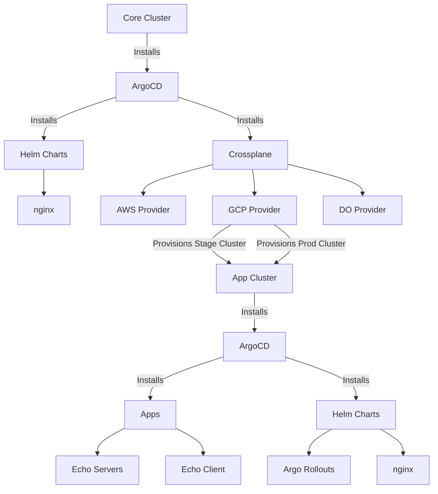
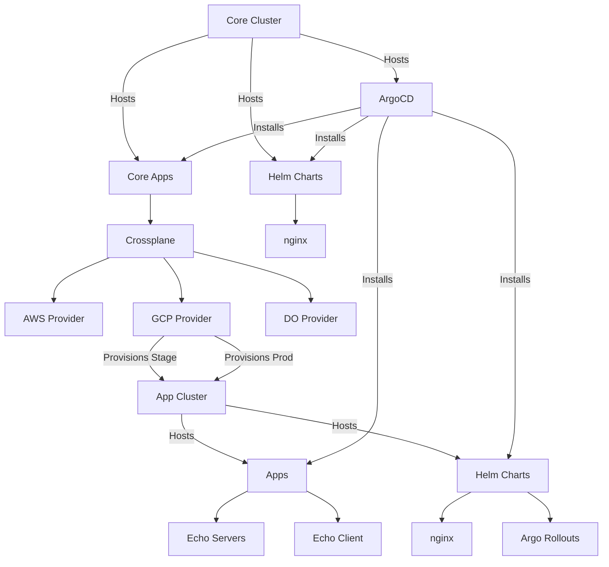
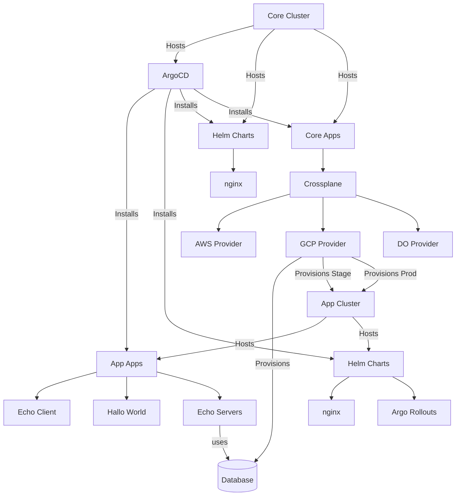
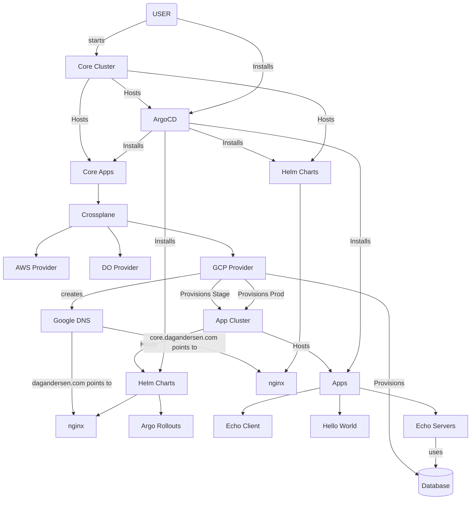
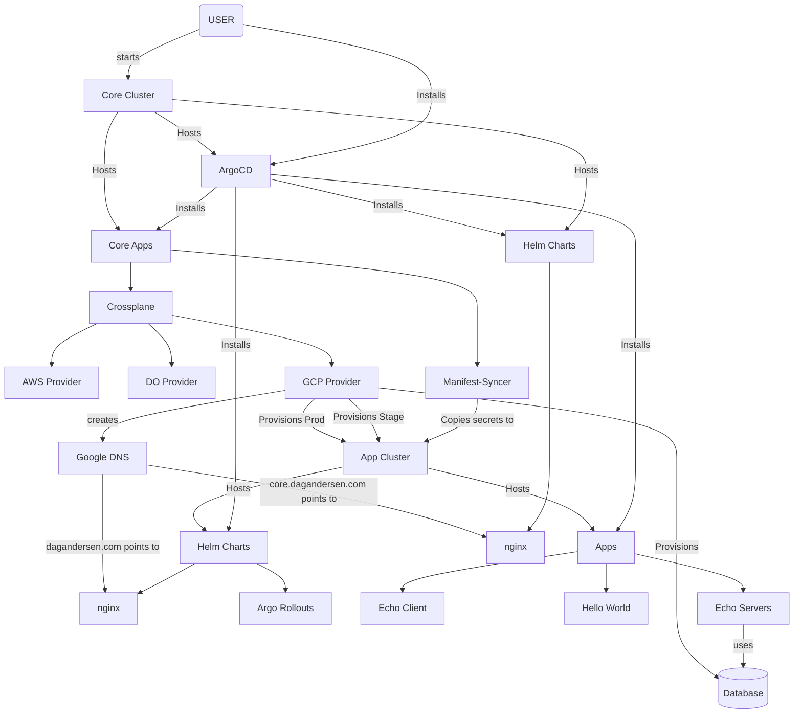
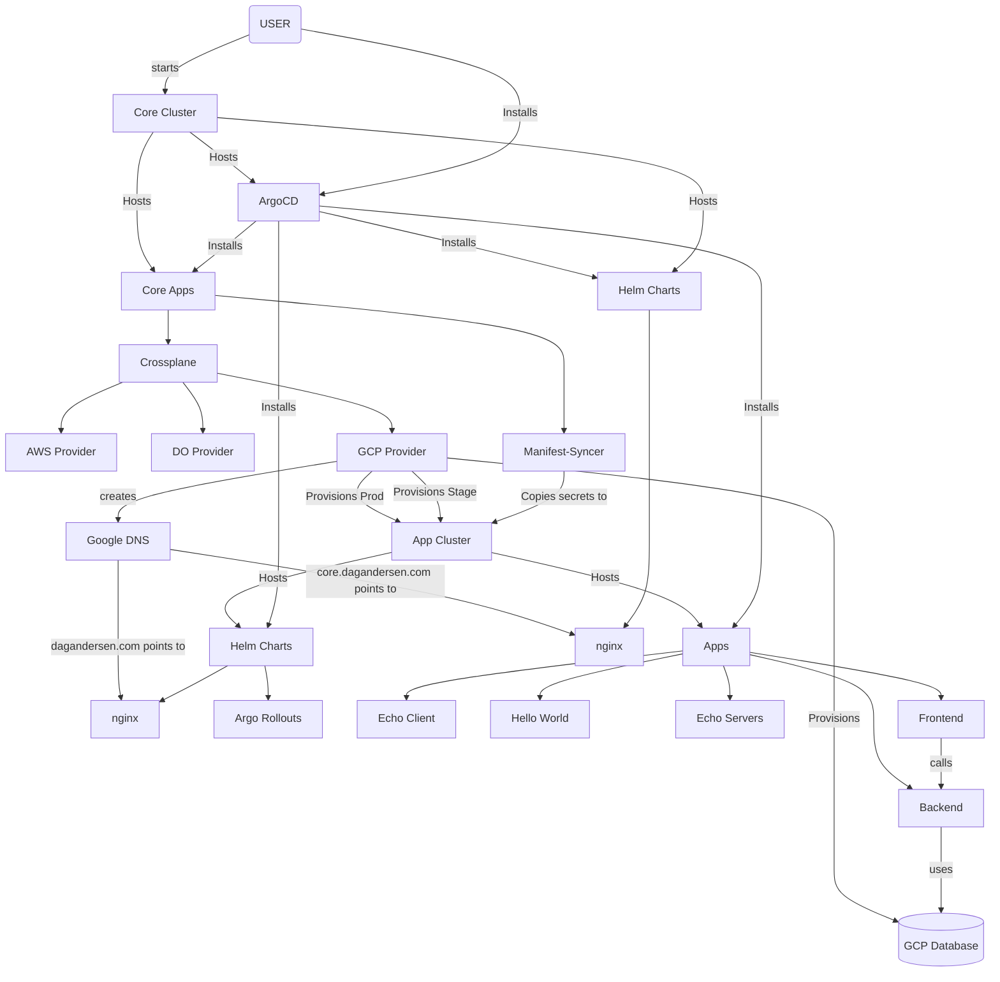
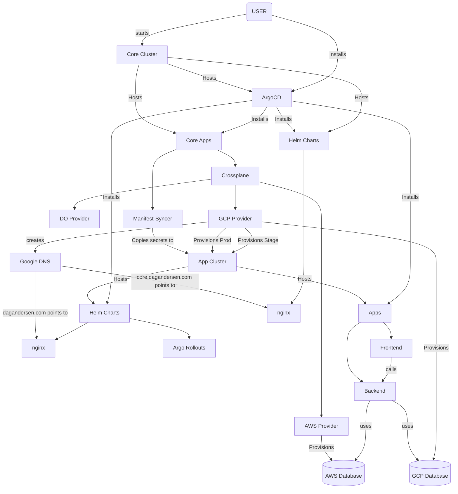

# cloud-infra

```mermaid
graph TD
    A[Core Cluster] --> |Installs| B[ArgoCD]
    B               --> |Installs| C[Crossplane]
    B               --> |Installs| D[Helm Charts]
    D --> H[nginx]
    C --> E[AWS Provider] 
    C --> F[GCP Provider] 
    C --> G[DO Provider] 
    F --> |Provisions Stage Cluster| AA
    F --> |Provisions Prod Cluster| AA
    AA[App Cluster] --> |Installs| BB[ArgoCD]
    BB              --> |Installs| CC[Apps]
    BB              --> |Installs| DD[Helm Charts]
    DD --> EE[Argo Rollouts]
    DD --> II[nginx]
    CC --> FF[Echo Servers]
    CC --> GG[Echo Client]
```

I moved from this :arrow_up: to this :arrow_down:

```mermaid
graph TD
    CC[Core Cluster] --> |Hosts| ARGO[ArgoCD]
    CC              --> |Hosts| CAPPS[Core Apps]
    CC              --> |Hosts| CHELM[Helm Charts]
    AC[App Cluster] --> |Hosts| AAPPS[Apps]
    AC              --> |Hosts| AHELM[Helm Charts]
    CAPPS           --> Crossplane[Crossplane]
    Crossplane      --> E[AWS Provider] 
    Crossplane      --> F[GCP Provider] 
    Crossplane      --> G[DO Provider] 
    F --> |Provisions Stage| AC
    F --> |Provisions Prod| AC
    ARGO              --> |Installs| CAPPS
    ARGO              --> |Installs| AAPPS
    ARGO              --> |Installs| CHELM
    ARGO              --> |Installs| AHELM
    CHELM --> cnginx[nginx]
    AHELM --> anginx[nginx]
    AHELM --> EE[Argo Rollouts]
    AAPPS --> FF[Echo Servers]
    AAPPS --> GG[Echo Client]
```

```mermaid
graph TD
    CC[Core Cluster] --> |Hosts| ARGO[ArgoCD]
    CC              --> |Hosts| CHELM[Helm Charts]
    CC              --> |Hosts| CAPPS[Core Apps]
    AC[App Cluster] --> |Hosts| AAPPS[App Apps]
    AC              --> |Hosts| AHELM[Helm Charts]
    CAPPS           --> Crossplane[Crossplane]
    Crossplane      --> E[AWS Provider] 
    Crossplane      --> GCP[GCP Provider] 
    Crossplane      --> G[DO Provider] 
    GCP             --> |Provisions| DB[(Database)]
    GCP --> |Provisions Stage| AC
    GCP --> |Provisions Prod| AC
    ARGO              --> |Installs| AAPPS
    ARGO              --> |Installs| AHELM
    ARGO              --> |Installs| CHELM
    ARGO              --> |Installs| CAPPS
    CHELM --> cnginx[nginx]
    AHELM --> anginx[nginx]
    AHELM --> EE[Argo Rollouts]
    AAPPS --> GG[Echo Client]
    AAPPS --> HW[Hallo World]
    AAPPS --> FF[Echo Servers]
    FF    --> |uses| DB
```

```mermaid
graph TD
    USER(USER)      --> |starts| CC[Core Cluster]
    CC              --> |Hosts| ARGO[ArgoCD]
    USER            --> |Installs| ARGO
    ARGO            --> |Installs| CHELM
    CC              --> |Hosts| CHELM[Helm Charts]
    CC              --> |Hosts| CAPPS[Core Apps]
    AC              --> |Hosts| AAPPS[Apps]
    AC              --> |Hosts| AHELM[Helm Charts]
    CAPPS           --> Crossplane[Crossplane]
    Crossplane      --> E[AWS Provider] 
    Crossplane      --> G[DO Provider] 
    Crossplane      --> GCP[GCP Provider] 
    GCP             --> |Provisions| DB[(Database)]
    GCP             --> |Provisions Stage| AC[App Cluster]
    GCP             --> |Provisions Prod| AC
    GCP             --> |creates| DNS[Google DNS]
    DNS             --> |core.dagandersen.com points to| cnginx
    DNS             --> |dagandersen.com points to| anginx
    ARGO            --> |Installs| AHELM
    ARGO            --> |Installs| CAPPS
    ARGO            --> |Installs| AAPPS
    CHELM           --> cnginx[nginx]
    AHELM           --> anginx[nginx]
    AHELM           --> AR[Argo Rollouts]
    AAPPS           --> EC[Echo Client]
    AAPPS           --> HW[Hello World]
    AAPPS           --> ES[Echo Servers]
    ES              --> |uses| DB
```

```mermaid
graph TD
    USER(USER)      --> |starts| CC[Core Cluster]
    CC              --> |Hosts| ARGO[ArgoCD]
    USER            --> |Installs| ARGO
    ARGO            --> |Installs| CHELM
    CC              --> |Hosts| CHELM[Helm Charts]
    CC              --> |Hosts| CAPPS[Core Apps]
    AC              --> |Hosts| AAPPS[Apps]
    AC              --> |Hosts| AHELM[Helm Charts]
    CAPPS           --> Crossplane[Crossplane]
    Crossplane      --> E[AWS Provider] 
    Crossplane      --> G[DO Provider] 
    Crossplane      --> GCP[GCP Provider] 
    GCP             --> |Provisions Prod| AC
    GCP             --> |Provisions Stage| AC[App Cluster]
    GCP             --> |Provisions| DB[(Database)]
    CAPPS           --> syncer[Manifest-Syncer]
    syncer          --> |Copies secrets to| AC
    GCP             --> |creates| DNS[Google DNS]
    DNS             --> |core.dagandersen.com points to| cnginx
    DNS             --> |dagandersen.com points to| anginx
    ARGO            --> |Installs| AHELM
    ARGO            --> |Installs| CAPPS
    ARGO            --> |Installs| AAPPS
    CHELM           --> cnginx[nginx]
    AHELM           --> anginx[nginx]
    AHELM           --> AR[Argo Rollouts]
    AAPPS           --> EC[Echo Client]
    AAPPS           --> HW[Hello World]
    AAPPS           --> ES[Echo Servers]
    ES              --> |uses| DB
```

```mermaid
graph TD
    USER(USER)      --> |starts| CC[Core Cluster]
    CC              --> |Hosts| ARGO[ArgoCD]
    USER            --> |Installs| ARGO
    ARGO            --> |Installs| CHELM
    CC              --> |Hosts| CHELM[Helm Charts]
    CC              --> |Hosts| CAPPS[Core Apps]
    AC              --> |Hosts| AAPPS[Apps]
    AC              --> |Hosts| AHELM[Helm Charts]
    CAPPS           --> Crossplane[Crossplane]
    Crossplane      --> E[AWS Provider] 
    Crossplane      --> G[DO Provider] 
    Crossplane      --> GCP[GCP Provider] 
    GCP             --> |Provisions Prod| AC
    GCP             --> |Provisions Stage| AC[App Cluster]
    GCP             --> |Provisions| GDB[(GCP Database)]
    CAPPS           --> syncer[Manifest-Syncer]
    syncer          --> |Copies secrets to| AC
    GCP             --> |creates| DNS[Google DNS]
    DNS             --> |core.dagandersen.com points to| cnginx
    DNS             --> |dagandersen.com points to| anginx
    ARGO            --> |Installs| AHELM
    ARGO            --> |Installs| CAPPS
    ARGO            --> |Installs| AAPPS
    CHELM           --> cnginx[nginx]
    AHELM           --> anginx[nginx]
    AHELM           --> AR[Argo Rollouts]
    AAPPS           --> EC[Echo Client]
    AAPPS           --> HW[Hello World]
    AAPPS           --> ES[Echo Servers]
    AAPPS           --> efiFront[Frontend]
    AAPPS           --> efiBack[Backend]
    efiFront        --> |calls| efiBack
    efiBack         ---> |uses| GDB
```

```mermaid
graph TD
    USER(USER)      --> |starts| CC[Core Cluster]
    CC              --> |Hosts| ARGO[ArgoCD]
    USER            --> |Installs| ARGO
    ARGO            --> |Installs| CHELM
    CC              --> |Hosts| CHELM[Helm Charts]
    CC              --> |Hosts| CAPPS[Core Apps]
    AC              --> |Hosts| AAPPS[Apps]
    AC              --> |Hosts| AHELM[Helm Charts]
    CAPPS           --> Crossplane[Crossplane]
    Crossplane      --> AWS[AWS Provider] 
    Crossplane      --> G[DO Provider] 
    Crossplane      --> GCP[GCP Provider] 
    syncer          --> |Copies secrets to| AC
    GCP             --> |Provisions Prod| AC
    GCP             --> |Provisions Stage| AC[App Cluster]
    AWS             --> |Provisions| ADB[(AWS Database)]
    CAPPS           --> syncer[Manifest-Syncer]
    GCP             --> |creates| DNS[Google DNS]
    DNS             --> |core.dagandersen.com points to| cnginx
    DNS             --> |dagandersen.com points to| anginx
    ARGO            --> |Installs| AHELM
    ARGO            --> |Installs| CAPPS
    ARGO            --> |Installs| AAPPS
    CHELM           --> cnginx[nginx]
    AHELM           --> anginx[nginx]
    AHELM           --> AR[Argo Rollouts]
    AAPPS           --> efiFront[Frontend]
    AAPPS           --> efiBack[Backend]
    efiFront        --> |calls| efiBack
    efiBack         ---> |uses| GDB
    efiBack         ---> |uses| ADB
    GCP             --> |Provisions| GDB[(GCP Database)]
```