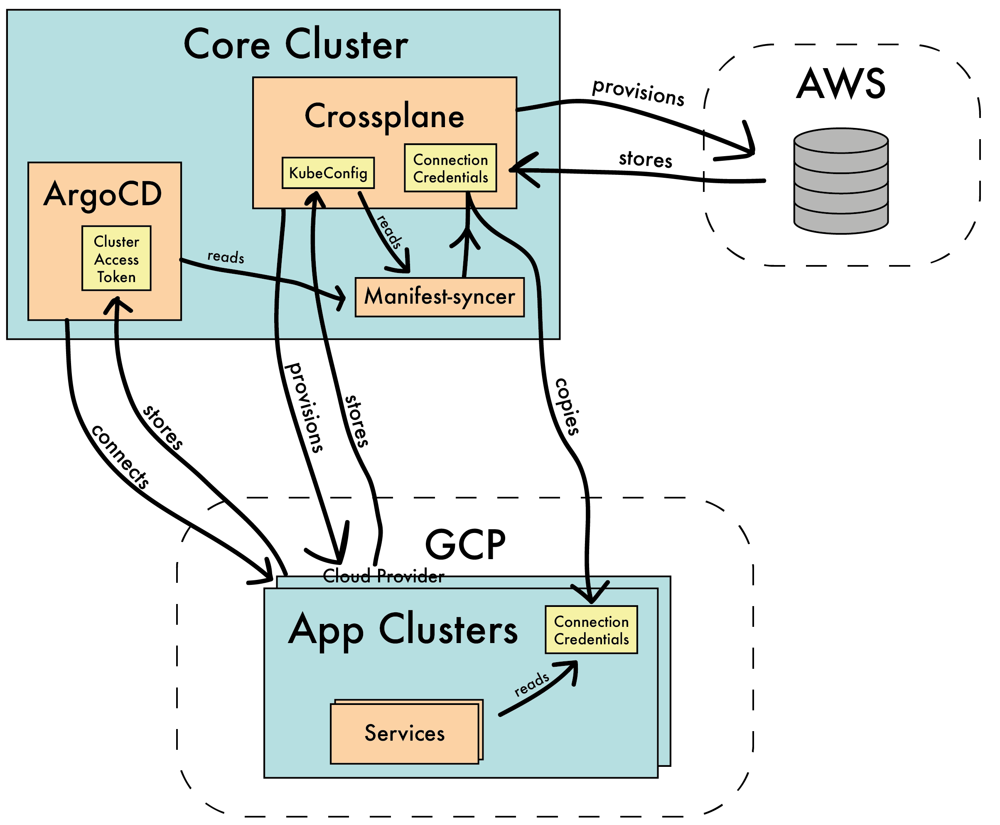
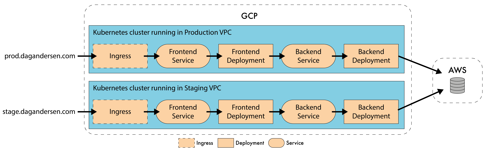
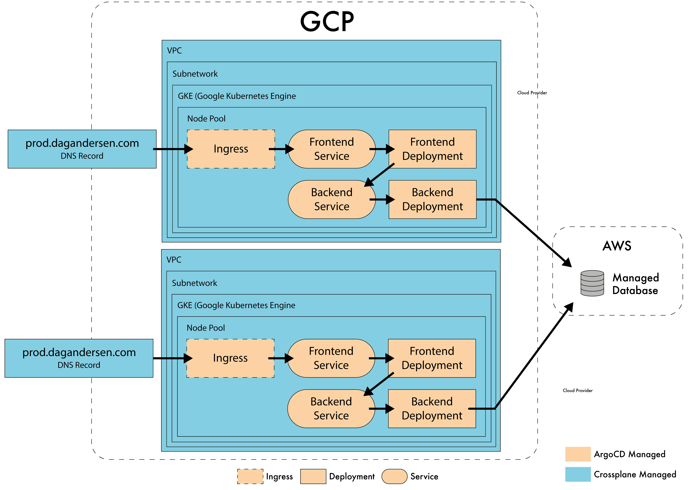

# 1. Utilizing Kubernetes as an universal control plane
<!-- 
IMPORTANT LINK: https://blog.crossplane.io/crossplane-vs-k8s-ucp-bootstrapstructure-addons/
IMPORTANT LINK: https://blog.crossplane.io/announcing-terrajet/
https://faun.pub/how-to-build-a-gitops-workflow-with-argocd-kustomize-and-github-actions-f919e7443295

"it’s a loop process created by Kubernetes that takes care of routine tasks to ensure the desired state of an object, or set of objects, running on the cluster matches the observed state." M4_ Introduction to Kubernetes Workloads v1.7.pdf

- https://blog.upbound.io/outgrowing-terraform-and-migrating-to-crossplane/
- https://www.libhunt.com/compare-terraform-vs-crossplane
- https://www.eficode.com/blog/outgrowing-terraform-and-adopting-control-planes
- https://blog.crossplane.io/crossplane-vs-terraform/
- https://youtu.be/UffM5Gr1m-0
- https://www.youtube.com/watch?v=UffM5Gr1m-0&ab_channel=Crossplane
- https://betterprogramming.pub/crossplane-and-beyond-36a7cd855ce0
- https://blog.argoproj.io/using-argo-cd-with-vclusters-5df53d1c51ce

https://www.youtube.com/watch?v=JqkwOWYcx2w&ab_channel=CNCF%5BCloudNativeComputingFoundation%5D
https://www.youtube.com/watch?v=9qRF-BjoAeU&ab_channel=CNCF%5BCloudNativeComputingFoundation%5D


https://adambrodziak.pl/terraform-is-terrible

It is called Kubernetes objects and not Kubernetes resources.
-->

# 2. Abstract

... missing

A testing application will be described and used to demonstrate the unversial contol planes capabilities. 

# 3. Table of Contents

- [1. Utilizing Kubernetes as an universal control plane](#1-utilizing-kubernetes-as-an-universal-control-plane)
- [2. Abstract](#2-abstract)
- [3. Table of Contents](#3-table-of-contents)
- [4. Dictionary and abbreviations](#4-dictionary-and-abbreviations)
- [5. Introduction](#5-introduction)
  - [5.1. Motivation](#51-motivation)
  - [5.3. Declarative vs Imperative](#53-declarative-vs-imperative)
    - [5.3.1. Terraform](#531-terraform)
      - [5.3.1.1. Barrier of entry](#5311-barrier-of-entry)
      - [5.3.1.2. Challenges with managing state](#5312-challenges-with-managing-state)
      - [5.3.1.3. State automation](#5313-state-automation)
      - [5.3.1.4. Crossplane as an alternative](#5314-crossplane-as-an-alternative)
- [6. Test Application](#6-test-application)
- [7. Implementation](#7-implementation)
  - [7.1. List of tools/technologies used in this implementation](#71-list-of-toolstechnologies-used-in-this-implementation)
  - [7.2. Managing internal state](#72-managing-internal-state)
    - [7.2.1. Other applications/packages](#721-other-applicationspackages)
    - [7.2.2. Eventual consistency](#722-eventual-consistency)
    - [7.2.3. Repository structure](#723-repository-structure)
  - [7.3. Managing External State](#73-managing-external-state)
  - [7.4. Distributing secrets](#74-distributing-secrets)
    - [7.4.1. Getting access to the App Clusters](#741-getting-access-to-the-app-clusters)
- [8. Putting it all together](#8-putting-it-all-together)
  - [8.1. Use in practice](#81-use-in-practice)
    - [8.1.1. Developer creating a new service with an associated database](#811-developer-creating-a-new-service-with-an-associated-database)
    - [8.1.2. Deploying a new service version to the multiple cloud environments](#812-deploying-a-new-service-version-to-the-multiple-cloud-environments)
    - [8.1.3. Spinning up the cluster form scratch](#813-spinning-up-the-cluster-form-scratch)
- [9. Discussion and evaluation of implementation](#9-discussion-and-evaluation-of-implementation)
  - [9.1. Build pipelines are still required](#91-build-pipelines-are-still-required)
  - [9.2. Cost](#92-cost)
  - [9.3. Not everything can be in code.](#93-not-everything-can-be-in-code)
  - [9.4. Security](#94-security)
  - [9.5. Platform Engineering](#95-platform-engineering)
  - [9.6. Workload overview and infrastructure replicability.](#96-workload-overview-and-infrastructure-replicability)
  - [9.7. Bootstrapping Problem](#97-bootstrapping-problem)
  - [9.8. Streamlining your codebase](#98-streamlining-your-codebase)
  - [9.9. Limitations](#99-limitations)
    - [9.9.1. Lack of providers | Early days | Maturity level](#991-lack-of-providers--early-days--maturity-level)
    - [9.9.2. Multiple core-clusters](#992-multiple-core-clusters)
  - [9.10. Eliminating state?](#910-eliminating-state)
- [10. Conclusion](#10-conclusion)
- [11. References](#11-references)


# 4. Dictionary and abbreviations

<!-- - CaC? [[source]](https://octopus.com/blog/config-as-code-what-is-it-how-is-it-beneficial#:~:text=Config%20as%20Code%20(CaC)%20separates,version%20control%20for%20your%20configuration.) -->
- **Infrastructure as Code (IaC)**: IaC is the managing and provisioning of infrastructure through code instead of through manual processes [[s](https://www.redhat.com/en/topics/automation/what-is-infrastructure-as-code-iac)].
- **GitOps**: GitOps is an operational framework that takes DevOps best practices used for application development such as version control, collaboration, compliance, and CI/CD, and applies them to infrastructure automation [[s](https://about.gitlab.com/topics/gitops)]
- **Reconciler pattern**: Reconciler pattern I the concept of checking the difference between the desired state and the current state, and if there is a difference, it tries to take action to make the current state to the desired state [[s](https://www.learnsteps.com/how-kubernetes-works-on-a-reconciler-pattern/)].
- **Control plane**: WORK IN PROGRESS! Control planes follow the Reconciler pattern. A control plane is a service that watches a configuration and acts upon it when it changes. An example of this is Kubernetes' internal control plan that schedules pods/containers based on a declared state.
- **Cloud Native**: Cloud native technologies empower organizations to build and run scalable applications in modern, dynamic environments such as public, private, and hybrid clouds [[s](https://github.com/cncf/foundation/blob/main/charter.md#1-mission-of-the-cloud-native-computing-foundation)]. Kubernetes is the best example of this.
- **Cloud Native Computing Foundation (CNCF)**: CNCF is the open source, vendor-neutral hub of cloud-native computing, hosting projects like Kubernetes and Prometheus to make cloud-native universal and sustainable. [[s](https://www.cncf.io/)].
- **Google Cloud Platform (GCP)**: Cloud computing platform provided by Google.
- **Amazon Web Services (AWS)**: Cloud computing platform provided by Amazon.

# 5. Introduction

With the creation of Kubernetes, we are seeing a rise in popularity of Control Planes. The concept is built on the idea that you declare a state and services, then watches the state and make sure that the system's actual state reflects the state declared. If the desired state changes, the control plane ensures that the new state is automatically reflected in the actual state. Control planes are self-healing, and they automatically correct drift.

Kubernetes is a perfect ecosystem fundament for control planes because most events that happen inside is controlled by control planes. At its core, Kubernetes stores a state declared in YAML, and different services watch this state and make sure the actual state reflects the declared state. Kubernetes can easily be extended by creating new services that watch the state and act accordingly. During the last years, new control planes have emerged that also manage external resources. It works more or less the same way, but now the services instead ensure that some external state corresponds to declared

Now the question is if we can combine these tools in order to create a universal control plane for handling all kinds of states, all managed from within Kubernetes. How would such a setup look? How would you interact with it? And what concerns and implications may such a setup bring?

## 5.1. Motivation

This paper is written in collaboration with Eficode. Eficode is a consultant company that specializes in DevOps. Eficode helps companies support or transform their DevOps processes. Eficode is always interested in keeping up with the latest trends and technologies in DevOps, so they can give their customers the best advice.

Eficode has already written about how Terraform does not scale well for big organizations in their post: [Outgrowing Terraform and adopting control planes](https://www.eficode.com/blog/outgrowing-terraform-and-adopting-control-planes). Terraform has proven to be a stable and reliable infrastructure tool for many years now, but it may not always be the best solution. New technologies get showcased, and new paradigms emerge. 

Control Planes is a new paradigm in the realm of DevOps and infrastructure management. Many of the technologies leveraging the concept of control planes are still considered new and do not have many years of proven use. Even though many of the tools/systems look promising, it can be difficult to justify the investment in transitioning a DevOps infrastructure to this new paradigm. 

In order to recommend customers to transition infrastructure managed by control planes instead of tools like Terraform, it is essential to know the implications of such changes and what kind of challenges such a change might bring. This paper will implement a universal control plane for handling both software deployment and cloud resources and discuss the implications.

The design and implementation presented in this paper is done by myself, and Eficode has not been part of it.

<!-- Burde dette flyttes ned til evaluering?
Furthermore, it can be demanding and expensive to modernize a company to the newest technologies because the employees may not have the required skills and knowledge to utilize all the latest tools. Therefore it is beneficial to limit the number of languages and systems introduced in the company. Instead of needing to learn the syntax and mental model of many different tools, then it would be advantageous to only need the knowledge about Kubernetes. Having a single abstraction for everything. 
-->


<!-- Det her kunne faktisk være meget godt
Control planes is based on so called `Reconciler pattern`. If a service follows the Reconciler pattern it is based on the idea checking the difference between the desired state and the current state and if there is a deviation, a it tries to take action to make the current state reflect the desired state.
 -->


<!-- filler talk
We are seeing a rise in the concept of control planes in the world of infrastructure. The most popular example of this is in relation to Kubernetes. 
A core component in Kubernetes is the control plane, which watches a declared state and schedules containers accordingly. If the desired state changes, the control plane ensures that the new state is reflected in the actual state. 
-->


<!-- arguments for control planes / crossplane ------------------------------------------------------

"the very essence of this new paradigm called ‘Control planes’ and which is poised to replace more traditional Infrastructure-as-Code tools like Terraform." [[source](https://www.eficode.com/blog/outgrowing-terraform-and-adopting-control-planes)]


_Michael Vittrup Larsen_ from Eficode puts it like this:
> "Using control planes means relinquishing control. Therefore seasoned SRE teams may feel a reluctance in trusting the control plane. While we still need to see how e.g. Crossplane fairs in the heat of the battle, we will eventually adopt control planes also for cloud. Not being distracted by details and instead abstracting them away and letting the ‘machines’ handle the details is a natural evolution in tech.
> "We have seen this all the way from operating systems, compilers and container platforms like Kubernetes. Knowing that this is the inevitable evolution, we should embrace control planes. If Crossplane does not strike the right balance and abstraction level, the next control plane will." [[source](https://www.eficode.com/blog/outgrowing-terraform-and-adopting-control-planes)]

"Control planes are self-healing. they automatically correct drift. Consumers can self-service fast because control planes offer a single point of control for policy and permissions and control planes integrate easily with other systems because they expose an API, not just a command-line." [[source](https://crossplane.io/)]


>>>>>"Composability is the ability to build higher level abstractions using lower level abstractions and is key to scaling adoption of any technology - including cloud." [[source](https://www.eficode.com/blog/outgrowing-terraform-and-adopting-control-planes)]


**This raises questions like:**

- Kubernetes' control planes are great for handling its internal state - but what prevents it from handling external states as well?
- Can we build/declare our complete tech stack inside Kubernetes in order to streamline and simplify our codebase?
- Is control planes a better abstraction from a software developer standpoint or does it just introduce new issues?
- Can everything be managed by a control planes - or is some things fundamentally incompatible with this paradigm? 
- Can we simplify the development experience by reducing the number of tools required to provision infrastructure and deployment systems?

-->

## 5.3. Declarative vs Imperative

If we want to build a universal control plane for handling all our infrastructure, we need to base it on some core design ideas. First of all, we need to want to build our infrastructure as Infrastructure as Code (IaC) using as much declarative configuration as possible. We want to limit the amount of imperatives commands and long scripts of sequential steps as much as possible. 

Declarative and Imperative is two different DevOps Paradigms. Declarative Programming specifies _what_ final state we want, while imperative programming specifies _how_ we want to get to a given state.

<!--
> Where? This concept makes the developers focus on _what_ state they want in the system and not _how_ to get there. We often see this approach in Infrastructure as Code, but with control planes we add the extra detail that the service is constantly syncing the actual state with the declared state. 
--->

We see this paradigm all across software development, from CSS in web development [[source]](https://edward-huang.com/distributed-system/programming/2021/02/28/why-you-should-always-design-your-api-declaratively-instead-of-imperative/) to Terraform in infrastructure management. 

The imperative setup scales poorly in large software environments. "While using an imperative paradigm, the user is responsible for defining exact steps which are necessary to achieve the end goal, such as instructions for software installation, configuration, database creation". The developer has to carefully plan every step and the sequence in which they are executed. Suppose a change in the setup has to be made. In that case, the developer has to carefully make sure the change doesn't break something else in the sequence of steps - especially if there are conditional-statements, meaning there are multiple possible paths through the sequence of steps. Although suitable for small deployments, imperative DevOps does not scale and fails while deploying big software environments, such as OpenStack" [[source]](https://ubuntu.com/blog/declarative-vs-imperative-devops-done-right)

Creating a declarative configuration is a higher abstraction than declaring a configuration with sequential imperative steps. Every declarative API encapsulates an imperative API underneath. For an declarative API work, there needs to be some code behind the scenes that parses the files and acts upon them in an imperative way. Declarative programming can not stand alone because there will always be a sequence of imperative steps executing some operations on a machine. [[source]](https://edward-huang.com/distributed-system/programming/2021/02/28/why-you-should-always-design-your-api-declaratively-instead-of-imperative/) and [[source]](https://ubuntu.com/blog/declarative-vs-imperative-devops-done-right).


<!--
Why gitOps?
https://www.youtube.com/watch?v=l5pVzP6wsP0&ab_channel=CNCF%5BCloudNativeComputingFoundation%5D
https://opengitops.dev/
https://www.youtube.com/watch?v=8xhEPPA6XUs&ab_channel=Weaveworks%2CInc.
https://www.weave.works/technologies/gitops/
https://blog.mergify.com/gitops-the-game-changer/

-->

### 5.3.1. Terraform

<!-- Det her skal måske bare slettes eller skrives ind i afsnittet lige nedenunder -->
This project is supposed to handle cloud resources, and we need to cover how this is frequently done in the industry and what challenges it brings. This paper will, in later sections, describe how a universal control plane for handling external resources may overcome some of the challenges presented in this section. 

A very popular tool that is based on the idea of IaC and declarative configuration is Terraform. Terraforms' popularity started in 2016-2017 and has been going strong ever since. Now Terraform has integration with more than 1700 providers [[source]](https://www.hashicorp.com/resources/the-story-of-hashicorp-terraform-with-mitchell-hashimoto). So the natural question is now, why bother with control planes when tools like Terraform exists? This section will describe some of the issues related to using Terraform and why it might be better to use control planes for handling external resources. 

Terraform is an Infrastructure as Code tool that lets you define both cloud and on-prem resources in configuration files that you can version, reuse, and share. You can then use a consistent workflow to provision and manage all of your infrastructure throughout its lifecycle. Terraform can manage all kinds of resources, from low-level components to huge cloud provider-managed services [[source]](https://www.terraform.io/intro). Terraform has the concept of terraform-providers, where service providers can create integrations with Terraform and let the user manage the providers' services through the HashiCorp Configuration Language (HCL). "Providers enable Terraform to work with virtually any platform or service with an accessible API" [[source]](https://www.terraform.io/intro). 

#### 5.3.1.1. Barrier of entry 
The only practical way of using Terraform in teams is to store the state in some remote place. This is commonly done on a cloud provider in some kind of "bucket"/"blobstorage". Setting this up can be a big hurdle to overcome if you have not done it before and you are not an experienced developer. So before you can solve _whatever your code is supposed to solve_, you first need to solve the problem of _how and where to store the Terraform state_, before you can even start developing anything in your team. 

Removing this step by switching to control planes is a selling point on its own. Lowering the amount it takes to start up projects is always a good thing. 

#### 5.3.1.2. Challenges with managing state

If you are a distributed team, it is a must to store the Terraform state in some remote place. But just because it is shared in a remote place does not mean two people can work on it at the same time.

<!-- no lock -->
When storing the state in a remote place, you need to specify a so-called `backend`, but not all `backend`s support locking. This means that in some cases, race conditions can still happen (if two people run `terraform apply` at the same time). An example of this is that there is no lock on the state if stored on AWS S3. A solution to this is to store lock file somewhere else (e.g. AWS DynamoDB) [[source]](https://adambrodziak.pl/terraform-is-terrible). This, again just adds to the complexity and works an even bigger barrier if you want to make sure your Terraform is safe to use. 

<!-- force unlocking -->
Furthermore, if a `terraform apply` goes wrong because the process is interrupted for whatever reason, the state can end up not being unlocked, and you have to `force-unlock` the state [[source]](https://www.terraform.io/cli/state/recover). This is, of course, a great feature to solve the issue - but the main problem here is that this can happen to begin with.
Things can get even worse if a `force-unlock` is executed while another process is in the middle of applying [[source]](https://www.terraform.io/language/state/locking). Managing a mutual state in a distributed state is difficult at its core. 

<!-- only one person at a time -->
But even though there may be a lock that makes sure that there is no race condition while applying, only one person/process can work on the state at once. Updating a Terraform state can take minutes - e.g., it will take around 10 minutes to spin up a GKE cluster on GCP [[source](https://learn.hashicorp.com/tutorials/terraform/gke)]. "During this time no other entity - no other engineer - can apply changes to the configuration." [[source](https://blog.crossplane.io/crossplane-vs-terraform/)]. This is an even bigger problem when you have a monolithic setup with a lot of dependencies. So if one developer is updating the GKE cluster, then another developer may be blocked from updating a database or a networking rule.

<!-- drift -->
Another challenge with Terraform state is that Terraforms state can easily go out of date with reality. This is called _configuration drift_ [[source](https://adambrodziak.pl/terraform-is-terrible) and [source](https://blog.upbound.io/outgrowing-terraform-and-migrating-to-crossplane/)]. If the `terraform apply`-command is not run regularly, the actual state can drift away from the declared/desired state. This means the state no longer reflects the real world. This can create issues when later mutating the stored state, which can make the stored state unusable because it is so far from the actual state. 

This can both be a gift and a curse. If it is an emergency, then it is possible to modify the terraform-created-resource manually through some other service (e.g., a person could change a network rule manually through Google Cloud Platform) without it being reverted by some automated tool.

So the Terraform state can either be updated by a manual task (e.g., a developer manually creating a database), a triggered automated task (e.g., a deployment pipeline that applies the newly changed Terraform files - e.g. [Atlantis](https://www.runatlantis.io/) or Terraform Cloud), or some GitOps tool that continuously syncs the actual state with the declared state stored in a repo (or elsewhere).

#### 5.3.1.3. State automation

You could install an automated tool or script that just does this `terraform apply` on a regular basis to ensure that there is no _configuration drift_. This is a reasonable approach, but then you are essentially creating a system that works just like a control plane. So instead of using a tool with all its issues and then patching some of the issues by wrapping it in some automation tool/script... why not just use a control plane that was built to solve exactly with that?

Kubernetes stores desired state, and the internal components try to keep the actual state as close as possible to the desired state. The state is stored as Kubernetes objects definitions declared in YAML. Why not store the same information usually stored in Terraform state inside Kubernetes instead?
A control plane running on Kubernetes could automatically sync (similar to continuously running `terraform apply`) the actual infrastructure with the declared state in YAML. 

This is where tools like _Crossplane_, Google's _Config Connector_, and AWS' _Controllers for Kubernetes_ come into play. This paper will focus on Crossplane because it is built as a foundation for control planes in general and not only focuses on a single cloud provider.

Even though the paper highlights Crossplane as a tool, the question is not so much if Crossplane specificity is a great tool or not - but more about whether the paradigm of control planes is good in general. As Eficode states: "If Crossplane does not strike the right balance and abstraction level, the next control plane will." [[source](https://www.eficode.com/blog/outgrowing-terraform-and-adopting-control-planes)]

#### 5.3.1.4. Crossplane as an alternative

The most popular cloud-native control plane tool for handling external state is _Crossplane_. Crossplane is a CNCF project that tries to streamline cloud providers' APIs. 

<!-- her er der en gentagelse af noget fra terraform afsnittet. Jeg ved ikke endnu hvilken del der skal slettes hvorfra  -->
Crossplane tries to follow the success of Terraform and apply some of the same concepts to Kubernetes. Terraform has the concept of _providers_. A Terraform provider is a Terraform plugin that allows users to manage an external API. "Terraform uses providers to provision resources, which describe one or more infrastructure objects like virtual networks and compute instances. Each provider on the Terraform Registry has documentation detailing available resources and their configuration options." [[source]](https://www.terraform.io/cdktf/concepts/providers). Crossplane mimics this concept, so external organizations can create a plugin that integrates with crossplane providing the user the ability to provision external resources.

<!-- multi-cloud -->
Crossplane can be used to provision resources for all cloud providers if the cloud provider has created a Crossplane provider for it.
As a company/organization, it can be beneficial to have the option to be multi-cloud because different cloud providers have different offerings. 

Terraform uses HashiCorp configuration language (HCL), while crossplane use `YAML` and follows the same structure conventions as Kubernetes manifests.

<!-- Transitioning -->
It can be a big jump to go from Terraform to Control planes, which is why tools like _Kubeform_ and _the Terraform provider for Crossplane_ exist. Kubeform provides auto-generated Kubernetes CRDs for Terraform resources so that you can manage any cloud infrastructure in a Kubernetes native way. This requires you to rewrite your HCL to Kubernetes CRDs, so if that is too time-consuming, you can instead you can use Crossplane's Terraform provider. This provider lets you copy-paste your Terraform syntax directly into a CRD, and Crossplane will, in concept, run `terraform apply` automatically. This could be an intermediate step before doing a complete transition from Terraform to Crossplane. 

Crossplane will be described in greater detail in the _Managing External State_-section. 

# 6. Test Application

In order to test the universal control plane I am trying to build presented in the _Implementation_-section, I need a test application that runs on the infrastructure and demonstrates its capabilities. 

To do this, I have used Eficode's public `quotes-flask` application that they use for educational purposes. It is a simple application consisting of a frontend, backend, and a database.

The frontend is a website where you can post and retrieve "quotes". The quotes are posted and sent to the backend-service, which then stores the data in a Postgres database.

This system is built to be run in Kubernetes, and the repository already contains YAML-files. The system uses a Postgres database running in a standalone pod. To showcase the implementation of a universal control plane's ability to provision database resources on cloud-providers, I have replaced the Postgres-database-pod with a managed database running in a cloud provider. Besides that, I have not changed the overall architecture. 


This setup is supposed to represent an actual production-ready application a small business may want to run on a cloud provider.

The business may want multiple environments like _production_, _staging_, and _development_, and they may leverage cloud services across multiple cloud providers. 
Therefore the aim of the system is to look something like the image below.


The architecture will demonstrate the universal control plane's multi-cloud and multi-environment capabilities.

The evaluation of this project will partially be based on how well the implemented universal control plane manages to host/deploy/run this test application and what implications/challenges it may bring.

# 7. Implementation

<!-- what will be in this Implementation-section? -->
This section will describe how I suggest building a universal control plane within Kubernetes for handling internal and external resources. The implementation strives to imitate a production-ready system for a small company with a website running in a production and staging environment in the cloud.

<!-- main idea -->
The main idea of this implementation is to have a single cluster that works as a control plane. This cluster will provision other clusters and deploy software to them.

<!-- naming -->
For the section, I'll introduce two names: `core cluster` and `app cluster`. The `core cluster` is the control plane for managing your infrastructure and software environment. The `app clusters` is a shared term for all the clusters where business logic is supposed to run. For instance, a company may have two `app cluster`s in the form of a production cluster and a staging cluster. The `core cluster` that hosts all the shared services between different `app cluster` environments. 


> Figure X: An visualization/drawing of how SREs/The infrastructure team manage `app clusters` through the `core cluster`.

Only the infrastructure teams are supposed to interact with `core cluster` directly - while the application developers are supposed to only care about getting their workload running on the `app cluster`s. 

<!-- intro to ArgoCD and crossplane -->
The `core cluster` will use Crossplane for provisioning cloud resources and use ArgoCD to deploy and manage all services that are running in the core cluster and the app clusters. Crossplane and ArgoCD are both open-source tools funded by the CNCF. They are created as Control planes for Kubernetes, and together they can be used to create a control for managing your whole multi-cloud multi-environment infrastructure. 


> Figure X: An visualization of how ArgoCD and Crossplane works together to provision cloud resources.

ArgoCD handles all internal state, while Crossplane handles all external states - Combined, they can be used as a universal control plane.

As mentioned previously, the question is not whether Crossplane or ArgoCD are great tools or not - but more about whether the paradigm of control planes is good in general. As Eficode states: "If Crossplane does not strike the right balance and abstraction level, the next control plane will." [[source](https://www.eficode.com/blog/outgrowing-terraform-and-adopting-control-planes)]

This setup can easily be extended by other tools. Crossplane is currently focused on cloud providers (but nothing prevents it from expanding to new topics in the future), so if you want to manage external resources that are not cloud-related, you could just install a control plane for that as well. The point is that for the use cases I have presented, only using ArgoCD and Crossplane is sufficient, but other control planes could easily be added if more features were needed.

## 7.1. List of tools/technologies used in this implementation

**ArgoCD**
ArgoCD is a GitOps tool using control planes, and it runs inside Kubernetes. ArgoCD is used for this implementation because it more advanced UI features compared to similar tools. The two biggest GitOps Tools are FluxCD and ArgoCD. This implementation could also be built using FluxCD. FluxCD and ArgoCD cover most of the same features, but the way you structure code looks a bit different. Both tools would be good candidates for building a universal control plane for Kubernetes.
> ArgoCD was accepted to CNCF on April 7, 2020, and is at the Incubating project maturity level [[source](https://www.cncf.io/projects/argo/)].

**Crossplane**
Crossplane is used in this implementation because it is the only option if you want a control plane that works with multiple cloud providers (and is not just a Terraform copy-pasted into a control plane setup). If a multi-cloud architecture is not needed, one could instead opt for Google's _Config Connector_, or AWS' _Controllers for Kubernetes_.
> Crossplane was accepted to CNCF on June 23, 2020, and is at the Incubating project maturity level. [[source](https://www.cncf.io/projects/crossplane/)]

**Google Cloud Platform**
GCP was chosen as the main provider for cloud-hosted Kubernetes clusters because it is less complex to use than AWS but advanced and mature enough to work well with crossplane. Another choice would be DigitalOcean, but I experienced some issues with using Crossplane with DigitalOcean (also described in the _limitation_ section). I didn't experiment with Microsoft Azure since I had no prior experience working with them as a cloud provider. Both AWS and Azure would be a potential alternatives to GCP in this implementation. 

**Kind**
kind is used for running the Kubernetes cluster locally. When developing and experimenting with this setup, it can be beneficial to run the setup locally because it can take a long time to provision clusters on cloud providers (e.g., it often takes 10 minutes on GCP). There are many different tools for running Kubernetes locally, and many of them would probably work for this implementation, but the choice ended with Kind because it is easy to set up and simple to use. Other alternatives could be _MicroK8s_ or _Docker Desktop_. 

**Gum**
Gum is a simple command line tool for making interactive scripts. When you want to start any type of custom-made system from a terminal, it usually involves creating multiple scripts for doing some of the initial bootstrapping. Gum was chosen as a simple tool for interactively picking a configuration on runtime instead of having to remember command parameters or creating static config-script.

**Helm and Kustomize**
Helm and Kustomize are used to template and install Kubernetes resources. Helm is a package manager for Kubernetes. ArgoCd installs external packages (like Crossplane) using Helm. Kustomize is used for handling templating of my own Kubernetes manifests. One could choose not to use kustomize and instead put everything into helm charts as an alternative to this implementation. 

## 7.2. Managing internal state

<!-- intro -->
Everything deployed to the clusters is declared in YAML, checked into git, and read by ArgoCD. 

<!-- one or more clusters -->
ArgoCD can either be installed on each cluster individually (only controlling the local state) or on a shared cluster which then handles the deployment to multiple clusters.

Installing ArgoCD on each cluster means there is no shared interface of all the infrastructure running across clusters. You would have to have multiple endpoints and multiple argo-profiles/-credentials for each argo instance running in each cluster, which may not be desirable if you run infrastructure on a large scale. Furthermore, it also consumes more resources to run all ArgoCDs components on each cluster (vs. only it on a single cluster), which may be a consideration if your company's budget is tight. 

For this implementation, a single instance of ArgoCD will run on the `core-cluster` and deploy and manage all the Kubernetes Object running in both the core cluster and the app clusters.

<!-- Applications -->
ArgoCD groups YAML-files/folders into an abstraction called _Applications_. Applications are just a normal Kubernetes manifest, where you specify a path to a resource you want to deploy, a destination cluster, and some configuration parameters. You can structure (and nest) these groupings however you want, but you usually want smaller groupings, so you manage/sync them individually with more fine-grained control. e.g., Deploying Crossplane provisioned database separately from the Crossplane provisioned Kubernetes Cluster. This way, you don't have to use the same sync-policy for both groupings of resources. e.g., you may have pruning (auto-delete) disabled on the database to ensure databases are not deleted by mistake. 

Based on this philosophy of separation, I have chosen to structure my applications like this:


> Figure X: An illustration of what packages/services ArgoCD installs and on which cluster.

### 7.2.1. Other applications/packages

Besides Crossplane, ArgoCD also installed other packages/services:

**NGINX**
In order to call the `Quote Frontend` from outside Kubernetes, we need to set up ingress. NGINX is an ingress controller that acts as a reverse proxy and load-balancer and handles all external traffic into the cluster. A cluster needs an ingress controller in order to call the endpoints inside Kubernetes from outside Kubernetes.

**Prometheus and Grafana**
Prometheus and Grafana is a famous open-source monitoring stack. This stack is not strictly needed to run the test application, but it is used to resemble a realistic setup you would see at a company. It is installed on both the core clusters and the app clusters, so it is possible to observe resource usage. 

### 7.2.2. Eventual consistency

<!-- intro -->
At its core, all ArgoCD reads from a given branch on a given repository and applies all the resources that it finds to Kubernetes. By default, there is no order to this process, but ArgoCD will just apply all the manifests, and then Kubernetes will handle the rest. 

<!-- dependencies -->
In any modern software environment, there exist dependencies. The amount of dependencies depends on how well your system is decoupled. 
If a typical company had to spin up its entire infrastructure from scratch, it would probably include a lot of sequential steps in a specific order because some of its services need other services to run.

<!-- how Argo handles eventual consistency -->
Doing sequential deployments through a script often takes a long time because it runs sequentially and not in parallel. With Eventual consistency, you can much easier run multiple steps at the same time. Kubernetes is full of eventual consistency. There is no order of when which resources/events are created/handled - instead, everything will just eventually be set up/running. Applying Kubernetes resources with ArgoCD works the same way. If ArgoCD fails to deploy one of these `Applications` (because some dependency may be missing), it will just automatically try again in a minute. This means I can apply our entire infrastructure at once with ArgoCD, and ArgoCD will make sure everything will be deployed with eventual consistency even though there is broken dependencies temporarily in the process. This also applies every time you update something in the infrastructure. Configuration and workload will be applied and scheduled whenever ArgoCD eventually syncs its state with whatever is stored in the chosen git repository. 

### 7.2.3. Repository structure

The structure for this implementation is split up into 3 repositories. One ArgoCD Synced repository for the `core-cluster`. A second ArgoCD synced repository for syncing with `app-cluster` and a general repository with code and scripts for bootstrapping the system.

```
root
├── k8s-ucp-bootstrap         # Repository with bootstrapping scripts
├── k8s-ucp-app-gitops        # Repository only containing app-cluster resources synced with ArgoCD
└── k8s-ucp-core-gitops       # Repository only containing core-cluster resources synced with ArgoCD
```

> `k8s-ucp` stands for _Kubernetes Universal Control Plane_.

The GitOps synced repositories do not contain anything other than resources synced with ArgoCD. Only automated tools and scripts commit changes to the repositories. 

You could choose to store the `core-cluster` and `app-cluster` in the same repository and store every ArgoCD-application for the whole organization in a single repository. From a technical standpoint, there is no problem with this solution. It may even be preferred because it will be easier to update the structure for a system requiring changes in multiple clusters simultaneously.

```
root
├── k8s-ucp-bootstrap           # Repository with bootstrapping scripts
└── k8s-ucp-gitops              # Repository containing all ArgoCD synced Resources
    ├── app-cluster
    └── core-cluster
```

On the other hand, you may not want everyone in the organization to have read-access to all infrastructure. The write-access would not be a problem since you can, e.g., use [`CODEOWNERS` on github](https://docs.github.com/en/repositories/managing-your-repositorys-settings-and-features/customizing-your-repository/about-code-owners). 

The main point here is that there are many ways to structure your GitOps synced repositories, and it all depends on what kind of needs you have in your organization. 

Below we can see the folder structure of the `Core Cluster` and `App Cluster`. Most resource that is applied by ArgoCD is structured/built with Kustomize using the [base-overlay-pattern](https://github.com/kubernetes-sigs/kustomize/blob/53cc76fe43c91493d093c2832cc61425aa2972e1/README.md#2-create-variants-using-overlays), thus why we have all the `base` and `overlays` folders. 

<table>
<tr>
<th> App Cluster Git Repo </th>
<th> Core Cluster Git Repo </th>
</tr>
<tr>
<td>


```
k8s-ucp-app-gitops
├── argo-bootstrap
│   ├── prod
│   └── stage
├── example-database-eficode-aws
│   ├── base
│   │   ├── backend
│   │   └── frontend
│   └── overlays
│       ├── prod
│       └── stage
├── example-database-eficode-gcp
│   ├── base
│   │   ├── backend
│   │   └── frontend
│   └── overlays
│       ├── prod
│       └── stage
└── kube-applications
    ├── base
    └── overlays
        ├── prod
        └── stage
```

</td>
<td>

```
k8s-ucp-core-gitops
├── projects            # Declaration of how Argo Applications are grouped
├── argo-bootstrap
│   ├── gcp
│   └── kind
├── argo-config         # Ingress configuration for accessing the argo server on GCP or kind. 
│   ├── base
│   └── overlays
│       ├── gcp
│       └── kind
├── aws-provider
├── aws-database
├── gcp-provider
├── gcp-database
├── gcp-clusters
│   ├── base
│   └── overlays
│       ├── prod
│       ├── prod-pre
│       ├── stage
│       └── stage-pre
├── manifest-syncer
└── kube-applications
    ├── base
    ├── envs
    │   ├── core
    │   └── experimental
    └── host
        ├── gcp
        └── kind
```

</td>
</tr>
</table>


## 7.3. Managing External State

In this implementation, I use Crossplane for managing the external resources. Crossplane is a control plane that runs inside Kubernetes that makes sure that the external resources described in YAML are in sync with the state declared in Kubernetes.

Here you can think about Terraform and the provider-integrations that exist. The developer creates a provider-configuration and is then able to create resources on that provider's infrastructure. It is now up to the provider to manage and ensure that the state running on their infrastructure matches the desired state declared in your Kubernetes cluster.

Currently, Crossplane supports AWS, GCP, and Azure as cloud providers. A DigitalOcean provider is also in active development [[source](https://www.digitalocean.com/blog/announcing-the-digitalocean-crossplane-provider)].

As an example, in order to provision a resource on AWS, you need to create a `Provider`, `ProviderConfig`, and _the resource you want_. So if we want to provision a Postgres database on AWS, we apply the following configuration to Kubernetes (with Crossplane installed):

<table>
<tr>
<th> Provider Configs </th>
<th> Provider Resources </th>
</tr>
<tr>
<td>

```yml
apiVersion: pkg.crossplane.io/v1
kind: Provider
metadata:
  name: aws-provider
spec:
  package: crossplane/provider-aws:v0.30.1
```
```yml
apiVersion: aws.crossplane.io/v1beta1
kind: ProviderConfig
metadata:
  name: aws-provider-config
spec:
  credentials:
    source: Secret
    secretRef:
      namespace: crossplane-system
      name: aws-creds
      key: creds
```

</td>
<td>

```yml
apiVersion: database.aws.crossplane.io/v1beta1
kind: RDSInstance
metadata:
  name: postgres-instance
spec:
  forProvider:
    region: eu-central-1
    dbInstanceClass: db.t2.small
    masterUsername: masteruser
    engine: postgres
    engineVersion: '12.10'
    skipFinalSnapshotBeforeDeletion: true
    publiclyAccessible: true
    allocatedStorage: 20
  providerConfigRef:
    name: aws-provider-config
  writeConnectionSecretToRef:
    namespace: crossplane-system
    name: aws-database-conn
```

</td>
</tr>
</table>

These YAML files are read by a _controller_ (which is provided by the crossplane-provider as a _helm-chart_). As a developer, you do not care how it is implemented behind the scene; you just know that the controller continuously tries to make sure the desired state is upheld. 

The controller will read the above `RDSInstance` and check that such an instance exists on the AWS account referenced in the `ProviderConfig`'s `credentials`-section. This is how crossplane is able to create DNS Records, VPCs, Subnets, Node Pools, Kubernetes Clusters, and databases in this setup. All this can be found in the `/gcp-clusters` in `core-cluster-argo-repo`.

Depending on which cloud-provider you are able to create, most cloud resources are offered by that cloud provider.

<!-- general crossplane stuff -->
This paper is not trying to argue that Crossplane is a perfect tool but rather that crossplane is just an example of tool that can be used to manage external resources from Kubernetes.

<!-- new providers -->
Crossplane is built to be highly extendable (just like Terraform), making it easy to create new providers. Currently, not a lot of providers exist, but I could imagine Datadog could create a crossplane-provider (equal to their Terraform provider integration), where the user could specify their dashboard declared in YAML and apply to the cluster. With Terraform, the user usually has to create the dashboard in Terraform and store it in a bucket. This works fine in practice, but one could argue that we don't need to store that state in a bucket. Instead, we could just store the declared state directly in Kubernetes together with the services you are monitoring. 

<!-- One instance or multiple instances of crossplane? -->
Just like ArgoCD, you can either install Crossplane on each cluster or install it in a shared cluster. Just like with ArgoCD, it provides much better visibility to only have a single instance running, making it easier to see which external resources are running outside Kubernetes.

Running Crossplane on a shared/core cluster also decouples the external resources from the actual clusters. This means that you don't lose the connection with the staging-database just because you close down staging-cluster temporarily. You rather want your external infrastructure to be managed from a cluster that you know will remain up and running. 

<!-- connection details -->
An important detail is that when crossplane creates a resource (e.g., database instance), it stores the connection details in the cluster on which 
Crossplane is running on. The problem here is that you often need the credentials in app clusters (e.g., you want your services running in the production environment to connect to the production database). There are many ways to handle secrets/credentials, but more on this in the _Distributing secrets_-section.

## 7.4. Distributing secrets

When crossplane creates a resource (e.g., Kubernetes cluster or database) on a cloud provider, it stores the connection details (e.g., access credentials) in the cluster where crossplane is installed - but in a setup with a `core-cluster`, that doesn't have any business logic running it is not very useful. The connection details to a database is needed in the production or staging environment. 

The challenge is also described on an issue on the `crossplane-contrib`-_GitHub Organisation_ [[source](https://github.com/crossplane-contrib/provider-argocd/issues/13)], and currently, no easy solution exists.

This shows how popular tools like ArgoCD and Crossplane do not necessarily go well together natively. These small gaps can easily occur when we are using many different tools from the Kubernetes ecosystem that were not necessarily meant to be used in conjunction with each other and do not have a native integration between the tools. As an infrastructure team, you may have to close these gaps yourself if you can't find an off-the-shelf component from GitHub that solves your problem. 
Many of these small gaps can be solved with a few scripts, a cronjob running a script, or small standalone service.

There are a few ways of overcoming this secret-distribution challenge. The most naive one would be to create a manual step where the developer needs to somehow copy the credentials to the production cluster whenever he/she decides to create a cluster.

Another way of doing this is using some kind of secret-vault where the credentials are stored during the creation of the database, and each cloud environment can read the credentials directly from the vault when needed. 
This may be considered best practice currently, and it comes with some nice benefits (which are beyond the scope of this paper) - but it nonetheless introduces even more tools/concepts to our infrastructure, which may put even more workload on a small infrastructure team.

This is why I have created a much simpler solution.

As usual, there are many ways of closing a gap, but we need to keep in mind that we want a declarative approach, so we want the distribution to happen eventually and not at a specific point in the rollout of a new cluster or new secret. Therefore I have implemented a service named `manifest-syncer`. The `manifest-syncer` purpose is to mirror secrets from its host cluster to target clusters. The service makes use of `CustomResourceDefinitions`, so the user of the service does not need to configure the service. They just deploy the container and create YAML-files describing what they want to be copied. The developer can then declare what he/she wants to be copied and where. 

```yaml
apiVersion: dagandersen.com/v1
kind: Syncer
metadata:
  name: secret-syncer
  annotations:
    argocd.argoproj.io/sync-options: SkipDryRunOnMissingResource=true
spec:
  data:
    - sourceName: gcp-database-conn
      sourceNamespace: crossplane-system
      kinds: secret
      targetCluster: gcp-cluster-prod
      targetNamespace: default
```

In this example, we can see how we specify the secret named `gcp-database-conn`, in namespace `crossplane-system`, should be copied to namespace `default`, on the cluster named `gcp-cluster-prod`.

> Note: `argocd.argoproj.io/sync-options: SkipDryRunOnMissingResource=true` is added to ensure that ArgoCD does not fail the deployment, because `Syncer` does not exist as custom resource at deployment time. This can happen when `Syncer`-manifest is *applied* before the `manifest-syncer` is deployed. ArgoCD will fix the failing resources with eventual consistency. 



> Figure X: A visualization of how credentials are generated and copied to the app clusters. 

### 7.4.1. Getting access to the App Clusters

In order for the `manifest-syncer` to have access to the App Clusters, it needs a kubeconfig. We don't want to provide/generate this kubeconfig manually each time we create a new cluster. Instead, we want the `manifest syncer` to fix this automaticity without having to change other services. 

The `manifest-syncer` automatically scans its host cluster for secrets generated by Crossplane with a key named: `kube-config`. <!-- need to verify this -->. This on its own is not enough because it only gives read-access to the cluster. To gain write access, it scans, fetches secrets generated by ArgoCD, and "steals" its access token to the clusters it is connected to. The manifest `manifest-syncer` combines the kubeconfig and access token and gets access to the app clusters in that way. This process is done continuously to automatically detect when new app clusters are created.

One could argue that it is bad practice to build your own small services like this because you need to maintain them yourself - but since the service is self-contained and does not directly interact with other services, it can easily be replaced by a better solution, should a company choose to invest in a more mature solution (like installing a secret-vault).

# 8. Putting it all together

In order to demonstrate that all the components actually work, I have built this setup to show how both internal and external state management plays together to have a fully declarative infrastructure setup managed from inside Kubernetes. 

In this setup, I have two environments running: production and staging. Each environment runs in its own VPN (and subnetwork) and subdomain on GCP. Both environments can connect to a shared database, either running on AWS or GCP. The demonstrations use AWS to show that this kind of setup works across different cloud providers. As described in the _XXXX_ section, each environment runs a simple frontend service, which calls a backend service, which then stores its data on the database. In practice, this results in an `ingress` object, two `service` objects, and two `deployment` objects per environment.

This is proof of concept. This paper is not arguing that this is good software architecture. 





The production and staging environment runs completely separate on GCP. This project makes it possible to (theoretically at least) scale the number of workload-environments to infinity through the `core-cluster` and _IaC_ based _GitOps_. 

Crossplane does not have a UI, but you can interact with it with `kubectl` like any other Kubernetes resource. Running `kubectl get managed` will print a list of all the resources managed by crossplane. The external resources used in this demo are shown blow.


> Here we can see that two VPCs (`network.compute.gcp`), two subnets (`subnetwork.compute.gcp`), six DNS records (`resourcerecordset.dns.gcp`), two k8s clusters (`cluster.container.gcp`), and two node pools (`nodepool.container.gcp`) are running on GCP and a single database instance (`rdsinstance.database.aws`) is running on AWS.

## 8.1. Use in practice

So far this paper has explained what control planes are and how one can build an entire infrastructure setup only using kubernetes. 

The _implementation_-section described how one instance of a system using kubernetes and control planes could look, but we not yet covered how we use the setup after creation. As we know, systems are not built once and never touched again. The setup/system needs to be maintainable and modifiable over time. 


It is important to say there is many philosophies and strategies when it comes to deployment of software. This paper gives an example of how to use ArgoCD together with Crossplane, but others may choose to structure their code differently. E.g if a user choose to use FluxCD (instead of ArgoCD) and Google's Config Connector, the optimal structure may look very different. 

If we want to convince ourself that this is actually a elegant setup, we fist need to envision how it would be used in practice in a company.
In this section we will go through some examples of how such a system would work in practice if implemented in a company. 

*The use-cases are:*

- Developer creating a new service with an associated database
- Deploying a new service version to the multiple cloud environments
- Spinning up the cluster form scratch

> These use-case examples assumes that the folder-structure is the same as described in the _Repository Structure_-section.

> Keep in mind that many of the tools used in this setup is under active development, so the feature set of these tools may change in future and change the workflows. 

### 8.1.1. Developer creating a new service with an associated database

_So how would the workflow be if a developer wants to create a new service with a new database instance?_

1. The developer creates a _pull request_ to the `core-cluster-gitops-repo` with the YAML describing the database instance and a `syncer` object for distributing the connection details to the database (as explained in _Distributing secrets_-section )
2. The developer creates a _pull request_ to the `app-cluster-gitops-repo` with the YAML describing all kubernetes objects required. This could for instance be YAML describing `ingress`, `service`, and `deployment` as with out test application.

Depending on the policy for this imaginary company it may be a person from the infrastructure team approving the provisioning of this new database, while it may be a person from the development team approving the normal app related kubernetes resources.


> Figure X: This image show how developer create/deploy new services with databases.

### 8.1.2. Deploying a new service version to the multiple cloud environments

_So how would the workflow be if a developer wants to update their service on e.g. the staging cluster?_

Most ArgoCD resources in this setup is generated using Kustomize. Kustomize use a folder pattern, where each configuration for a service is stored in the `overlay` folder. I this case the configuration _service A_ for the production environment would be stored in `service-a/overlays/prod/`.

Lets assume a developer team has a containerized service named: `service-a`. When a new version of `service-a` needs to be deployed, the developer creates a new _pull request_ with the committed changes. If commits are not on the main/master branch then the build pipeline builds the image and pushes it to e.g. dockerhub with a unique tag. In addition to that the pipeline also updates the service version in git-ops controlled repository with all the new tag. In this case the build system updates the `kustomization`-file in `/service-a/overlays/stage/` with the newest version that should be deployed to the staging cluster.

When the changes has been tested on the staging cluster and the PR has been merged into master/main, then the same process begins. The only difference is that the build-pipeline this time updates the `/service-a/overlays/prod/` instead. 


The _Argo Project_ (the organization behind all Argo tools) does not provide any opinionated standardized way of pushing a new commit with the new image tag/version. This usually ends up with each organization/team makes their own custom code for doing commit push to the GitOps-synced repo. 

### 8.1.3. Spinning up the cluster form scratch

_So how would the workflow be if an infrastructure engineer wants to spin up the entire setup from scratch?_ Essentially spinning up a core cluster, multiple app clusters and deploying every service/system described in the _managing internal state_-section.

1. Git pull the `scripts-repo`/`bootstrap repo`.
2. Run `make install-tools` in the root to pull down the dependencies.
3. Add your Cloud Provider and Git-repo credentials to the `./creds/`-folder.
4. Run `make start` in the root to start the interactive cli for choosing what resources to create.


This interactive-cli experience can be replaced with something else. e.g. it would be possible to replace the CLI with a simple UI if that is preferred. 

First you specify if you want the `core-cluster` to be running locally with `kind` or you want it to be run on _Google Cloud Platform_.
Other options can added relatively easily by adding scripts to the bootstrap-repo.

> choosing `local` is preferred when developing, since it takes around 10 minutes to spin up a GCP cluster and it only takes 20 sec to spin-up a local kind cluster.


You can either start everything up at once or start with `skip` and spin up whatever you need later. 

You can run the `make start` command as many times as you want. It will detect that you already have a cluster running and ask if you want to delete the currently running version.

By default (by choosing `skip`) the script will spin up a local containerized kubernetes cluster using _kind_ and install ArgoCD and deploy nginx (so you can connect to the cluster). ArgoCD will then apply all the crossplane related setup and apply the `manifest-syncer`. Now the baseline is set the `core cluster` can now be used as a control plane for spinning up external cloud resources, and deploy apps to external kubernetes clusters.  

Spinning up everything depends if you run the core cluster locally or on GCP. Spinning up a GKE cluster on GCP takes around 10 minutes [[source](https://learn.hashicorp.com/tutorials/terraform/gke)]. So if you run your `core cluster` locally it results in _~15_ minutes process to spin up the entire system, of which 10 of them is only waiting for GCP creating the `app clusters`. If you run your `core cluster` on GCP you have to wait an initial 10 minutes before the core clusters is created resulting in a combined wait time of _~25_ minutes to spin up the entire system. 

# 9. Discussion and evaluation of implementation

We have now explained how control planes work, how to build an entires system based on control planes, and showed how such a system could be used in pratice. 

Changing your infrastructure management to paradigm of control planes will make you re-evaluate bla bla bla

This section will discuss some of the challenges and limitations of this setup. These topics will give Eficode a better baseline for discussion pros and cons with their client when discussing if they should move infrastructure built on control planes. 

## 9.1. Build pipelines are still required

Switching to a GitOps workflow will not eliminate the need of pipelines. With the demonstrated setup you still need some kind of build-pipeline that runs whenever you have a new version of your app.


Classic build/deploy pipelines with kubernetes consist of 3 steps: _build image_, _push image_, and _apply yaml changes_ to kubernetes. ArgoCD introduces a new step where the gitops-synced-repo is updated ( - there is no standardized way of updating this gitops-synced-repo, so it usually ends with custom script that pushes a new version to the repo). So with ArgoCD there is still 3 steps included in the pipeline: The last step is just replaced with updating a repo instead of apply yaml changes to the cluster directly.

So in that sense we have not optimized much, we still have 3 steps in the deployment pipeline if we use GitOps/ArgoCD, but have now removed the need for direct access to the cluster from the pipelines. The pipeline instead needs access to the repo, where it suppose the push the changes.

As described in the _Declarative vs Imperative_-section we prefer declarative configuration when we have the option. All the steps in the pipelines are so far imperative. In order to avoid the need to create this custom imperative code that pushes the new configuration to the gitops-synced-repo, `argocd-image-updater`-project, was created. `argocd-image-updater` is part of the _Argo Project_ and tries to tackle this challenge by moving the image-version-update-logic into a kubernetes operator. Now the pipeline system should only worry about building and pushing images. We tried the `argocd-image-updater`, but experience issues connecting to _Docker Hub_ (as explained here: <link>). The `argo-image-updater`-project has been going on for at least 2 years, without reaching a stable state. So i will not consider this reliable option at the moment. The same tool exits in the FluxCD ecosystem [[source]](https://fluxcd.io/flux/components/image/imageupdateautomations/). The Flux automated image updater may function as intended, but since we went with the ArgoCD ecosystem it was not reasonable to try out the flux version in this limited time frame. 

Overall we have only managed to make the deployment process more complex by switching to GitOps/ArgoCD, but at the same time we have gained the well known benefints of GitOps [[source](https://blog.mergify.com/gitops-the-game-changer/) and more?]

## 9.2. Cost
When using kubernetes as a control plane we are running an extra kubernetes cluster, which is not free. Since this setup entails that we run a `core-cluster` (which doesn't provide any customer direct value) it will naturally mean that we spend more money on cloud resources than if we didn't run a `core-cluster`.

When running this implementation, more resources were required to run the `core-cluster` than the stage and production cluster examples combined. The ratio between the resources required by `core-cluster` and `workload-cluster`s, will depend on how much workload you run in production. But for my small examples the resources required by the `core-cluster` surpassed the other clusters combined, so if this setup would be adapted by a smaller company/team the economical aspect may be relevant. 

For this setup to be running properly without issues 3 nodes of type "e2-medium" were needed. On monthly basis this is XX$ just for running the `core-cluster`. 

## 9.3. Not everything can be in code.
Ip addresses needs to be reserved beforehand.

## 9.4. Security

<!-- Terraform -->
Security is naturally aspect managing a software infrastructure. Terraform on its own does not have has no concept of access control[[source](https://blog.upbound.io/outgrowing-terraform-and-migrating-to-crossplane/)] - You have to manage your access through credentials through the cloud provider. This works fine, but it is an extra set of credentials your organization has to manage. 

<!-- Crossplane -->
With tools like Crossplane the development teams does not even need to have (write) access to the cloud provider. All external resources could be managed through tools like crossplane. Crossplane would be the only entity with (write) access to the cloud providers.
"The (cluster) administrator then uses the integrated Role Based Access Control (RBAC) to restrict what people can ask Crossplane to do on their behalf."[[source](https://blog.upbound.io/outgrowing-terraform-and-migrating-to-crossplane/)]. All your access control can be moved to ArgoCD/kubectl - making kubernetes the only surface requiring access control.
This is also covered in Eficode's own article: ["Outgrowing Terraform and adopting control plane"](https://www.eficode.com/blog/outgrowing-terraform-and-adopting-control-planes).

<!-- ArgoCD -->
If you want to take it one step further, ArgoCD could be the only entity with write-access to clusters - Enforcing that everything is version controlled (checked into git) and reviewed my multiple parties, before any change goes into production. 

With tools like ArgoCD the development teams or automated pipelines does not need to have (write) access to the production cluster. All kubernetes objects could be managed through tools like ArgoCD.

> The only problem here is that ArgoCD does not delete resources when deleted from git. ArgoCD simple does not track what changed between each commit, meaning that it does know what has been created or deleted - ArgoCD only know what the current state should be and nothing else. FluxCD is needed to solve this. FluxCD has the feature of _Garbage collection_ that detects when resources are removed from git and deletes them in the cluster [[source](https://fluxcd.io/flux/components/kustomize/kustomization/#garbage-collection)]. So with ArgoCD this results in a manual task of deleting resources which the developer may not have access too. 

<!-- Wrap up -->
Combining ArgoCD and Crossplane you can create a workflow where external resources and business logic is checked into git and only goes into production through PRs with multiple reviewers.

How strict you want you permissions all depends on the policies and amount of trust in organization. This setup with Crossplane and ArgoCD makes it possible to create a system that is fairly restrictive. 

## 9.5. Platform Engineering

Platform engineering is gaining popularity the last two years [[source](https://www.cncf.io/blog/2022/07/01/devops-vs-sre-vs-platform-engineering-the-gaps-might-be-smaller-than-you-think/)]. This topic is a standalone topic and is not the main focus of this paper, but we just quickly want to highlight how control planes like _crossplane_ can modernize your infrastructure, by embracing Platform Engineering and self-service. Crossplane has the concept of [Composite Resources](https://crossplane.io/docs/v1.9/concepts/composition.html#composite-resources), that works an abstraction layer between the actual managed resource running on the cloud provider and the resource offered by the infrastructure team to the development teams. The developer then do not have to worry about where the database runs. The developer just request a database in yaml, and the rest is handled by the abstraction created by the infrastructure/platform team. The abstraction becomes a platform for the developer to use - and they can self-service/provision infrastructure by using the provided abstraction. Developers will only interact directly with kubernetes and not any other cloud platform/portal.

_"This conversation is less about crossplane vs terraform. This is more about using crossplane to build your own kind of api server, your own control plane that highlights and exposes the resources and the properties that you want your people in your organization. This is a little bit different saying: >>hey here is access to GCP. knock yourself out until we get the bill.<<"_ - Kelsey Hightower. [[source]](https://youtu.be/UffM5Gr1m-0?t=843). In other words, the developers can view the platform team as the cloud provider instead of seeing GCP as their cloud provider. Everything the developers needs is exposed through the abstraction provided by the platform team. [[source]](https://youtu.be/UffM5Gr1m-0?t=769)

This is also described in the security section. 

## 9.6. Workload overview and infrastructure replicability.  

One challenge big companies can have when their developers has direct access to the cloud resources is that cloud services gets created and forgotten about. These resources may have been created by accident or just used for a quick experiment. Other reasons could be that the resource is irrecoverable because the Terraform state was lost. The company ends up being charged for these un-utilized resources each month, because the company lack the knowledge if the services are actually used or not. Tools like Crossplane and ArgoCD can limit or mitigate this risk. 

ArgoCD has a feature to display all "orphan" resources that is not handled by ArgoCD (meaning it is no longer or never was checked into git). This is great for getting an overview of resources stored as infrastructure as code. Finding these cases can be essential in eliminating a false sense of security of the system being re-creatable should it go down. 

If these cases are not detected you may think for that you can re-create your production cluster without any issues, but in reality your services depend on a resource that was created manually and never checked into git.

Having a `core cluster` that functions as an control plane for the rest of you infrastructure helps you go from [_Pets to Cattle_](https://www.youtube.com/watch?v=Od7e6hqis7A&ab_channel=PrismaCloudbyPaloAltoNetworks). The easier it is to spin up new cluster the less we will treat our infrastructure as "pets" [[source](https://www.eficode.com/blog/outgrowing-terraform-and-adopting-control-planes)]. 

## 9.7. Bootstrapping Problem

Every automatic process require some manual task to start the process. This initial task/command can not be declarative, since a command is by definition is imperative.

In order to simplify the setup-process as much as possible, we aim to make the bootstrapping as simple, clean and error-safe as possible.The only bootstrapping done in this implemenetation is setting starting a cluster (used as `core-cluster`) and then installing ArgoCD on it. The rest of the setup is handled automaticity by ArgoCD with declarative/eventual consistency approach. 

The bootstrapping done in this implementation does not touch logging, monitoring, ingress, crossplane-related-stuff, helm-charts, etc, which you could be forced to install sequentially through a imperative script. 

The main point is that we can't remove bootstrapping entirely - but we can try to reduce it as much as possible. We would argue that this bootstrapping is fairly minimal, since it only does 2 steps. 1: Spin up core-cluster (locally or on cloud provider), 2: install and setup ArgoCD.

## 9.8. Streamlining your codebase

The setup described in this paper is build only using 2 file types: `.yaml` and `makefiles`. `.yaml` is used for declaring the state of the whole setup. Everything declared as _Infrastructure as Code_ and check into git (_GitOps_) - while `makefiles` are only for the intial bootstrapping. 

"Since Crossplane makes use of Kubernetes, it uses many of the same tools and processes, enabling more efficiency for users - without the need to learn and maintain entirely new tools" [[source](https://blog.upbound.io/outgrowing-terraform-and-migrating-to-crossplane/)]. This creates and extremely streamlined infrastructure, because it does not require knowledge about e.g Terraform, Ansible, or multiple scripting languages. I will consider this a huge benefit of this setup. 


## 9.9. Limitations

### 9.9.1. Lack of providers | Early days | Maturity level

Currently, the biggest limitation of using crossplane is the lack of providers and feature set each provider provides. 

When using kubernetes as a universal control plane for all of your infrastructure you rely heavily on the stability and flexibility of the controllers made by big cooperations or open-source communities. 

When you use ArgoCD you put all your faith in that its controller correctly deploy your services and does not randomly delete arbitrary pods. When you use Crossplane you rely on the controller/providers correctly provision the requested resource and managing their lifecycle correctly. You as a user of these control plane this is out of your hands and you rely sole only the tools. This is the same limitation that Terraform has. Terraform is only as good as the providers that integrate with Terraform. 

**We observed some issues when working with ArgoCD and Crossplane:**

- Digital Ocean's provider can not delete resources on their platform. This means crossplane can only be used to spin up e.g. databases and kubernetes clusters - but not delete them afterwards. This partially removes the purpose of crossplane. This is obviously not intentional, and will probably be fixed in the near future. Overall this is just an example of providers not being mature and ready for control planes like crossplane.

- ArgoCD can not natively deploy resources when the generated yaml-files gets too large (as described here : https://github.com/argoproj/argo-cd/issues/8128). This is completely out of your hands. So if you want to deploy certain helm-charts that generate long yaml files then you instead have to it find a custom workaround online or deploy it manually. This can be quite painful, since if ArgoCD cant deploy _every single resource_ declared in your infrastructure its useful ness is greatly reduced. 

- Crossplane will not generate/retrieve/store the `kube-config` in the `core-cluster` if the `workload-cluster` already exists when asked to spin up a `workload-cluster`. This means that if i delete the `core-cluster` and start a new one, the kubeconfig for each `workload-cluster` created are not stored on the new `core-cluster` and effectively lost. This can be fixed by just pulling the kubeconfig down manually with `gcloud`-cli and pushed into the `core-cluster`, but this is an undesirable error-prone workaround. I cant figure out if this is intentional by crossplane (maybe because of some security concern) or it just a bug/not-yet-implemented-feature. 
This is unfortunate, because if we can't delete the core-cluster then we still have a state/backup in this setup that we need to store somewhere (just like Terraform). 

- ArgoCD can not connect to a external cluster based on data stored as a secret in kubernetes. Argo can only connect to external clusters by running `argocd add cluster <context-name-found-in-kubeconfig>` on your machine. This goes against the idea of declaring everything in yaml by forcing the user to call a shell command manually. (described here:https://github.com/argoproj/argo-cd/issues/4651)

### 9.9.2. Multiple core-clusters

Running multiple instances of a `core-cluster`s at the same doesn't work well. You can easily spin up multiple `core-cluster`s at the same time. E.g. running a `core-cluster` on GCP and running one locally. The problem is that they each have their own internal desired state and may work against each other. One cluster may want to create a given resource on a cloud provider, while another may want to delete that resource. This results in race-conditions and unpredictable behaviour.

So the next question is how you test a configuration for the `core-cluster` if you can't spin up a new one, without it competing with the current version running. The only way to allow multiple `core-cluster`s to be run simultaneously is to run a complete copy of all your resources. So the copy could be named `core-cluster-copy` which then created e.g. a `prod-cluster-copy` and `aws-database-copy` and so on. It is fairly straight forward code-wise, so it is doable, but this would effectively double your cost infrastructure cost if you wanted to to a proper test of the `core-cluster`. 

//insert image maybe //


## 9.10. Eliminating state?

When spinning up a cluster we don't have the hassle of first storing the state (and all the setup required in that process) in a shared location. This means the process of getting cloud resources up and running is faster, than by using Terraform. This lowers the _barrier of entry_ and can be considered an improvement compared to using Terraform. 

Furthermore Terraform requires that you store the state in some shared space for developers to use, and you need to manage the permissions to this shared space. By switching to crossplane the state is now accessible through kubernetes which the developers already have access to. In that sense i would consider crossplane an improvement. This does not mean that developer now have access to all cloud resources, just because they have write permissions to kubernetes. You can still set permission based on different namespaces/UserAccounts by using the abstraction layers created with Composite Resources (as explained in the _Platform Engineering_-section). This way you can still have fine granted access to different cloud resourced based permissions in kubernetes.

# 10. Conclusion

The golden hammer approach

# 11. References


Why git?
https://www.youtube.com/watch?v=l5pVzP6wsP0&ab_channel=CNCF%5BCloudNativeComputingFoundation%5D
https://opengitops.dev/
