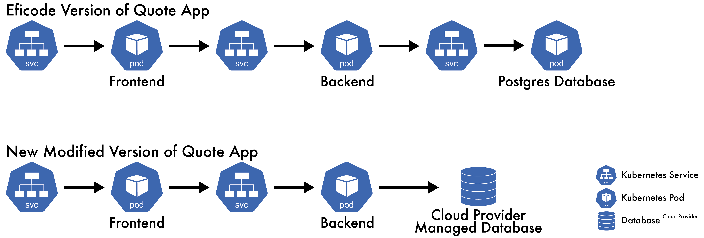
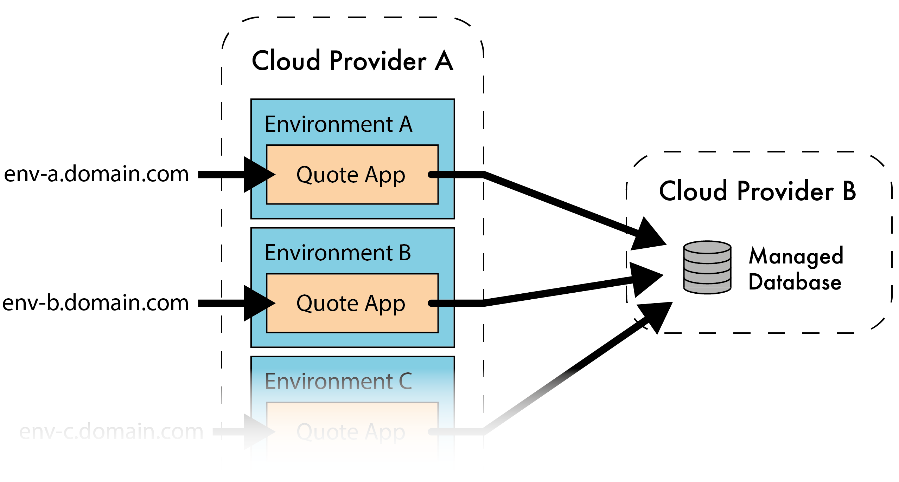
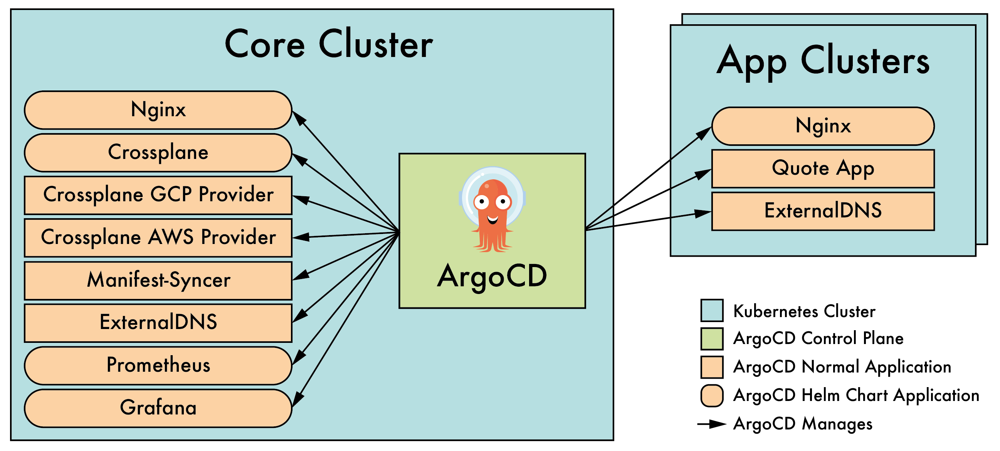
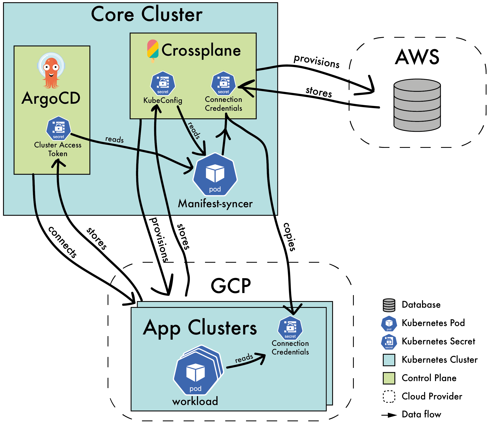
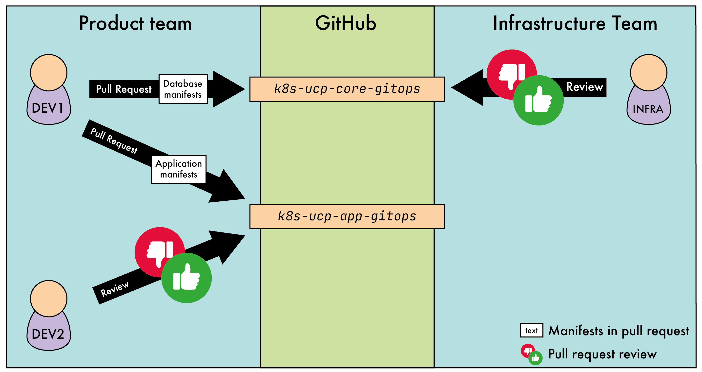

Utilizing Kubernetes as an universal control plane
<!-- 
IMPORTANT LINK: https://blog.crossplane.io/crossplane-vs-k8s-ucp-bootstrapstructure-addons/
IMPORTANT LINK: https://blog.crossplane.io/announcing-terrajet/
https://faun.pub/how-to-build-a-gitops-workflow-with-argocd-kustomize-and-github-actions-f919e7443295

"it’s a loop process created by Kubernetes that takes care of routine tasks to ensure the desired state of an object, or set of objects, running on the cluster matches the observed state." M4_ Introduction to Kubernetes Workloads v1.7.pdf

- https://blog.upbound.io/outgrowing-terraform-and-migrating-to-crossplane/
- https://www.libhunt.com/compare-terraform-vs-crossplane
- https://www.eficode.com/blog/outgrowing-terraform-and-adopting-control-planes
- https://blog.crossplane.io/crossplane-vs-terraform/
- https://youtu.be/UffM5Gr1m-0
- https://www.youtube.com/watch?v=UffM5Gr1m-0&ab_channel=Crossplane
- https://betterprogramming.pub/crossplane-and-beyond-36a7cd855ce0
- https://blog.argoproj.io/using-argo-cd-with-vclusters-5df53d1c51ce

https://www.youtube.com/watch?v=JqkwOWYcx2w&ab_channel=CNCF%5BCloudNativeComputingFoundation%5D
https://www.youtube.com/watch?v=9qRF-BjoAeU&ab_channel=CNCF%5BCloudNativeComputingFoundation%5D


Why gitops?
https://www.youtube.com/watch?v=l5pVzP6wsP0&ab_channel=CNCF%5BCloudNativeComputingFoundation%5D
https://opengitops.dev/


"Reconciliation refers to ensuring that a given state (e.g. application running in the cluster, infrastructure) matches a desired state declaratively defined somewhere (e.g. a Git repository)." [[link](https://fluxcd.io/flux/concepts/#reconciliation)]

idempotent: Idempotence, in programming and mathematics, is a property of some operations such that no matter how many times you execute them, you achieve the same result.


SSO login in argocd.


https://stackoverflow.com/questions/61365202/nginx-ingress-service-ingress-nginx-controller-admission-not-found


`argocd              argocd-server-5b8c45c484-bhzmm                           0/1     CrashLoopBackOff   2 (2m53s ago)   21m`


"Crossplane is a CNCF project that aims to unify all APIs in platform engineering based on Kubernetes API by leveraging Kubernetes controllers."[[s]](https://cloudnativesimplified.substack.com/p/crossplane-unifying-platform-engineering)


terraform to crossplane https://github.com/upbound/upjet

It is called Kubernetes objects and not Kubernetes resources.

//TODO
- find link related to argo-image-updater
- Skriv Abstract
- Skriv Conclusion
- Overvej om Challenges with managing state with terraform burde skrives om til 3 punkter. 
- No preview compared to terraform.
- brug mere life-cycle management. 
- forklar hvad crossplane er og argocd er.
- skriv afsnit om hvor ustabil GKE er. 
- Apps of Apps pattern.
- husk link til repo.
- I assume that the reader is familiar with Kubernetes, its concepts, and terminology. 

"Using control planes means relinquishing control. Therefore seasoned SRE teams may feel a reluctance in trusting the control plane.", https://www.eficode.com/blog/outgrowing-terraform-and-adopting-control-planes

-->
# 1. Abstract

<!-- 
Infrastructure management is in constant development.

Cloud Computing brings complete new abstraction layers for interacting with cloud resources.

Since the introduction of Kubernetes a new paradigm have emerged: Control Planes. Kubenretes is built on the control planes and the reconsiler pattern, and works as a echo system for control planes. 

Terraform

Control Planes

... missing

A testing application will be described and used to demonstrate the unversial contol planes capabilities. 

This explains the concept of control planes and how to build kubernetes as an universal control plane for handling internal resources (e.g _pods_) and external resources (e.g. databases) outside kubernetes.

<!-- what is control planes -->

<!-- The problem -->

<!-- demonstration app -->


<!-- the findings -->

<!-- further research
-->

# 2. Table of Contents

- [1. Abstract](#1-abstract)
- [2. Table of Contents](#2-table-of-contents)
- [3. Dictionary and abbreviations](#3-dictionary-and-abbreviations)
- [4. Introduction](#4-introduction)
- [5. Motivation](#5-motivation)
- [6. Defining Control Plane](#6-defining-control-plane)
- [7. Declarative vs Imperative](#7-declarative-vs-imperative)
  - [7.1. Terraform](#71-terraform)
    - [7.1.1. Barrier of entry](#711-barrier-of-entry)
    - [7.1.2. Challenges with managing terraform state](#712-challenges-with-managing-terraform-state)
  - [8. From Terraform to control planes.](#8-from-terraform-to-control-planes)
- [9. Demonstration Application](#9-demonstration-application)
- [10. Implementation](#10-implementation)
  - [10.1. Technologies and tools used in this implementation](#101-technologies-and-tools-used-in-this-implementation)
  - [10.2. ArgoCD and Crossplane together](#102-argocd-and-crossplane-together)
  - [10.3. Managing internal state with ArgoCD](#103-managing-internal-state-with-argocd)
    - [10.3.1. Eventual consistency](#1031-eventual-consistency)
    - [10.3.2. Repository structure](#1032-repository-structure)
  - [10.4. Managing External State with Crossplane](#104-managing-external-state-with-crossplane)
  - [10.5. Distributing secrets](#105-distributing-secrets)
    - [10.5.1. Getting access to the App Clusters](#1051-getting-access-to-the-app-clusters)
- [11. Demonstration Application running in Google Cloud](#11-demonstration-application-running-in-google-cloud)
  - [11.1. Use in practice](#111-use-in-practice)
    - [11.1.1. Developer creating a new service with an associated database](#1111-developer-creating-a-new-service-with-an-associated-database)
    - [11.1.2. Deploying a new service version to the multiple cloud environments](#1112-deploying-a-new-service-version-to-the-multiple-cloud-environments)
    - [11.1.3. Spinning up the cluster from scratch](#1113-spinning-up-the-cluster-from-scratch)
- [12. Discussion and evaluation of implementation](#12-discussion-and-evaluation-of-implementation)
  - [12.1. Build pipelines are still required](#121-build-pipelines-are-still-required)
  - [12.2. Additional costs](#122-additional-costs)
  - [12.3. Not _everything_ can be checked into code](#123-not-everything-can-be-checked-into-code)
  - [12.4. Single interface](#124-single-interface)
  - [12.5. Platform Engineering](#125-platform-engineering)
  - [12.6. Pets to Cattle : Denne title passer bedre til eliminating state.](#126-pets-to-cattle--denne-title-passer-bedre-til-eliminating-state)
  - [12.7. Streamlining your codebase](#127-streamlining-your-codebase)
  - [12.8. Bootstrapping Problem](#128-bootstrapping-problem)
  - [12.9. Multiple core-clusters](#129-multiple-core-clusters)
  - [12.10. Maturity level](#1210-maturity-level)
  - [12.11. Eliminating state](#1211-eliminating-state)
- [13. Conclusion](#13-conclusion)
- [14. References](#14-references)


# 3. Dictionary and abbreviations

It is assumed that the reader is familiar with Kubernetes, its concepts, and terminology. Furthermore it a assumed that reader is familiar with Terraform, how it manages its state, and how Terraform providers work. In addition to that there is a list of the additional terms and aberration used in this paper. 

<!-- - CaC? [[source]](https://octopus.com/blog/config-as-code-what-is-it-how-is-it-beneficial#:~:text=Config%20as%20Code%20(CaC)%20separates,version%20control%20for%20your%20configuration.) -->
- **Infrastructure as Code (IaC)**: IaC is the concept of managing and provisioning of infrastructure through code instead of through manual processes [[s](https://www.redhat.com/en/topics/automation/what-is-infrastructure-as-code-iac)].
- **GitOps**: GitOps is an operational framework that takes DevOps best practices used for application development such as version control, collaboration, compliance, and CI/CD, and applies them to infrastructure automation. GitOps is a branch of DevOps that focuses on using git repositories to manage infrastructure and application code deployments. The Git repository is the source of truth for the application configuration and code. [[s](https://about.gitlab.com/topics/gitops)]
- **Cloud Native**: The term cloud native refers to the concept of building and running applications to take advantage of the distributed computing offered by the cloud delivery model. Cloud native apps are designed and built to exploit the scale, elasticity, resiliency, and flexibility the cloud provides [[s](https://www.oracle.com/cloud/cloud-native/what-is-cloud-native/)]
- **Cloud Native Computing Foundation (CNCF)**: CNCF is the open source, vendor-neutral hub of cloud native computing, hosting projects like Kubernetes and Prometheus to make cloud native universal and sustainable [[s](https://www.cncf.io/)].
- **Amazon Web Services (AWS)**: Cloud computing platform provided by Amazon.
- **Google Cloud Platform (GCP)**: Cloud computing platform provided by Google.
- **Google Kubernetes Engine (GKE)**: Googles scalable and automated Kubernetes service. [[s]](https://cloud.google.com/kubernetes-engine)
- **Pets vs. Cattle**: i
- **State (in relation to Kubernetes)**: Refers to the collection of Kubernetes objects declared in manifests and stored in Kubernetes' etcd-database. The state both contain the _actual_ state of the system and the _desired_ (declared) state of the system [[s]](https://matthewpalmer.net/kubernetes-app-developer/articles/how-does-kubernetes-use-etcd.html). One state exist per Kubernetes cluster.
- **Internal State**: Internal state in this paper refers to declared Kubernetes Objects reflecting objects managed inside Kubernetes (e.g. _Pods_, _Service_, and _Ingress_)
- **External State**: External state in this paper refers to declared Kubernetes Objects reflecting objects managed outside Kubernetes (e.g. a database running on a cloud provider)
- **Reconciler pattern**: Reconciler pattern is the concept of checking the difference between the desired state and the actual state, and if there is a difference, an action is taken to make the actual state becomes the desired state [[s](https://www.learnsteps.com/how-kubernetes-works-on-a-reconciler-pattern/)].

# 4. Introduction

<!-- into to control planes -->
Since the creation of Kubernetes, we are seeing an increasing number of CNCF projects built as control planes (FluxCD, ArgoCD, Crossplane, whatever...). The concept of a control plane is built on the idea of service that watches a declared state and make sure that a system's actual state reflects the declared state. If the desired state changes, the control plane ensures that the new declared state is automatically reflected in the actual state.

<!-- ecosystem and now also external resources? -->
At its core, Kubernetes stores a declared state in its etcd-database, and different services (control plane components) watch this state and make sure the actual state reflects the declared state. Kubernetes can be used as an platform for control planes, because Kubernetes' API server can be queried to manipulate the state of its declared Kubernetes Objects. Control planes can call the API server and manage the life cycles of it's custom Kubernetes Objects (CRD[[s]](https://kubernetes.io/docs/concepts/extend-kubernetes/api-extension/custom-resources/#customresourcedefinitions)). Control planes in Kubernetes have proven to be good at managing internal state (e.g scheduling and deploying containers), but during the last years, new control planes like Crossplane that manage the state of cloud resources (e.g. databases and Kubernetes clusters) have emerged. This means control planes like Crossplane can be used to replaced infrastructure tools like Terraform, by controlling the cloud resources' life cycle from inside Kubernetes. 

<!-- big question -->
Now the question is if multiple control planes can be combine to create a universal control plane for handling all kinds of state, all managed from within Kubernetes. This paper will implement a universal control plane for handling both internal state (e.g. containers) and external state (e.g. cloud resources) and discuss the challenges and implications.

# 5. Motivation

<!-- who is Eficode? -->
This paper is written in collaboration with Eficode. Eficode is a consulting company that specializes in DevOps. Eficode offers consultancy, training, and managed services that enable organizations to develop quality software faster, using the leading methods and tools available. Eficode is committed to keeping up with the latest trends and technologies in DevOps, so they can give their customers the best advice and training [[text is in google link]](https://www.eficode.com/).

<!-- Eficode states Terraform may not scale as well -->
Eficode has stated their concern about how Terraform does not scale well for big organizations in their blogpost: [Outgrowing Terraform and adopting control planes](https://www.eficode.com/blog/outgrowing-terraform-and-adopting-control-planes). Terraform has proven to be a stable and reliable infrastructure tool for many years now, but it may not always be the best solution. New technologies get showcased, and new paradigms emerge. 

<!-- emerging paradigm -->
Control planes are a new paradigm in the realm of DevOps and infrastructure management [[source](https://www.eficode.com/blog/outgrowing-terraform-and-adopting-control-planes)]. Many of the technologies/tools leveraging the concept of control planes are still new and do not have many years of proven use. Even though such tools/systems can look promising, it can be difficult to justify the investment in transitioning a DevOps infrastructure to this new paradigm. 

<!-- recommendation -->
In order for Eficode to recommend customers to transition infrastructure managed by control planes instead of tools like Terraform, it is essential to know the implications of such changes and what kind of challenges such a change might bring.

The design and implementation presented in this paper is created and written by myself, and Eficode has not been part of it. The prototype presented and discussed in this paper allows Eficode to get a better understanding of the implications transitioning to control-plane-based infrastructure-management. 


<!-- arguments for control planes / Crossplane ------------------------------------------------------

"the very essence of this new paradigm called ‘Control planes’ and which is poised to replace more traditional Infrastructure-as-Code tools like Terraform." [[source](https://www.eficode.com/blog/outgrowing-terraform-and-adopting-control-planes)]


_Michael Vittrup Larsen_ from Eficode puts it like this:
> "Using control planes means relinquishing control. Therefore seasoned SRE teams may feel a reluctance in trusting the control plane. While we still need to see how e.g. Crossplane fairs in the heat of the battle, we will eventually adopt control planes also for cloud. Not being distracted by details and instead abstracting them away and letting the ‘machines’ handle the details is a natural evolution in tech.
> 
> "We have seen this all the way from operating systems, compilers and container platforms like Kubernetes. Knowing that this is the inevitable evolution, we should embrace control planes. If Crossplane does not strike the right balance and abstraction level, the next control plane will." [[source](https://www.eficode.com/blog/outgrowing-terraform-and-adopting-control-planes)]

Control planes are self-healing and they automatically correct drift.[[source](https://crossplane.io/)]
 Consumers can self-service fast because control planes offer a single point of control for policy and permissions and control planes integrate easily with other systems because they expose an API, not just a command-line." [[source](https://crossplane.io/)]

-->

# 6. Defining Control Plane

Control plane means something different depending on the context.

- **Control plane (as a concept/paradigm)** refers to the idea of a service that watches a declared state and make sure that a system's actual state reflects the declared state. A control plane reconciles the current state to match a desired state. Control planes follow the Reconciler pattern. Control planes are self-healing and they automatically correct drift [[s](https://crossplane.io/)].
- **Control plane (as a Kubernetes Controller)** refers to an application/service implemented as a control plane (the concept). An example of this is Kubernetes' kube-scheduler (that schedules pods/containers based on a declared state) [[s]](https://kubernetes.io/docs/concepts/overview/components/#kube-apiserver) or ArgoCD (a GitOps tool introduced in this paper). 
- **Control plane (as a node)** refer to a node where all kubernetes' default control plane components run (e.g. the kube-scheduler that schedules pods). Kubernetes' default control plane components can be run on any node in the cluster, but they often run on the same node and user containers do not run on this node [[s]](https://kubernetes.io/docs/concepts/overview/components/). This node is often refereed to as the control plane (node).
<!-- **Control plane**: Control planes is based on the Reconciler pattern. A control plane is a service that continuously checks the difference between the desired state and the current state and if there is a deviation, a it tries to take action to make the current state reflect the desired state. -->

When i refer to building a system that utilizes kubernetes as an _universal control plane_, I refer to a control plane as a _concept_. I think about kubernetes as an platform for hosting multiple control planes (as applications) that manages all kinds of state (both external and internal state). The universal control plane stores a single state (stored in kubernetes' etcd-database) where multiple implementations of control planes reconciles the current state to match a desired state.


<!-- 
In this paper I build an implementation of a universal control plane in kubernetes, where the user can manage both internal state (e.g. _Pods_) and external state (e.g. databases and other Kubernetes clusters).
-->

# 7. Declarative vs Imperative

<!--
When building a universal control plane for handling all our infrastructure, we need to base it on some core design ideas. First of all, we need to want to build our infrastructure as Infrastructure as Code (IaC) using as much declarative configuration as possible. We want to limit the amount of imperative commands and long scripts of sequential steps as much as possible.-

Declarative and imperative are two different DevOps paradigms [[s]](https://ubuntu.com/blog/declarative-vs-imperative-devops-done-right). In the declarative paradigm developers focus on _what_ the desired state of the system should be. In the imperative paradigm the developer focus _how_ a desired state is created.
-->

An automation system (like the universal control plane) can be designed and implemented in two different paradigms: declarative or imperative [[s]](https://ubuntu.com/blog/declarative-vs-imperative-devops-done-right). In the declarative paradigm developers focus on _what_ the desired state of the system should be. In the imperative paradigm the developer focus _how_ a desired state is created.

<!-- imperative setup scales poorly -->
The imperative paradigm scales poorly in large software environments. "While using an imperative paradigm, the developer is responsible for defining exact steps which are necessary to achieve the end goal, such as instructions for software installation, configuration, and database creation" [[s]](https://ubuntu.com/blog/declarative-vs-imperative-devops-done-right). The developer has to carefully plan every step and the sequence in which they are executed. Suppose a change in the setup has to be made. In that case, the developer has to carefully make sure the change doesn't break something else in the sequence of steps - especially if there are conditional-statements, meaning there are multiple possible paths through the sequence of steps. "Although suitable for small deployments, imperative DevOps does not scale and fails while deploying big software environments, such as OpenStack" [[s]](https://ubuntu.com/blog/declarative-vs-imperative-devops-done-right)


<!-- Den her block er måske useless  -->
<!-- declarative configuration is a higher abstraction -->
Creating a declarative configuration is a higher abstraction than declaring a configuration with sequential imperative steps. Every declarative API encapsulates an imperative API underneath. For a declarative API to work, there needs to be some code behind the scenes that parses the files and acts upon them in an imperative way. Declarative programming can not stand alone because there will always be a sequence of imperative steps executing some operations on a machine [[s]](https://edward-huang.com/distributed-system/programming/2021/02/28/why-you-should-always-design-your-api-declaratively-instead-of-imperative/),[[s]](https://ubuntu.com/blog/declarative-vs-imperative-devops-done-right). Even though creating a declarative configuration is often time more demanding creating a imperative configuration we see it all across software development, from CSS in web development [[s]](https://edward-huang.com/distributed-system/programming/2021/02/28/why-you-should-always-design-your-api-declaratively-instead-of-imperative/) to Terraform in infrastructure management. 

<!--
Why gitOps?
https://www.youtube.com/watch?v=l5pVzP6wsP0&ab_channel=CNCF%5BCloudNativeComputingFoundation%5D
https://opengitops.dev/
https://www.youtube.com/watch?v=8xhEPPA6XUs&ab_channel=Weaveworks%2CInc.
https://www.weave.works/technologies/gitops/
https://blog.mergify.com/gitops-the-game-changer/

-->

## 7.1. Terraform

A very popular tool that is based on the idea of IaC and declarative configuration is Terraform. Terraforms' popularity started in 2016-2017 and has been growing ever since [[s]](https://www.hashicorp.com/resources/the-story-of-hashicorp-terraform-with-mitchell-hashimoto).

Terraform lets you define both cloud and on-premises resources in configuration files that you can version, reuse, and share. [[s]](https://www.terraform.io/intro).
One of the main use case is often provisioning infrastructure on cloud providers [[s]](https://www.varonis.com/blog/what-is-terraform).
Terraform is responsible for handling the entire lifecycle of the resources: from creation to deletion. [[s]](https://www.terraform.io/intro)

Terraform is cloud-agnostic and can provision cloud resources across all the big cloud providers (e.g. AWS, Azure, and GCP) [[s]](https://www.varonis.com/blog/what-is-terraform).
Terraform has the concept of terraform-providers, where service providers (e.g. GCP) can create integrations with Terraform and let the user manage the providers' services through the HashiCorp Configuration Language (HCL). "Providers enable Terraform to work with virtually any platform or service with an accessible API" [[s]](https://www.terraform.io/intro). 

<!-- maybe here 
Terraform has the concept of _providers_.
A Terraform provider is a Terraform plugin that allows users to manage an external API. "Terraform uses providers to provision resources, which describe one or more infrastructure objects like virtual networks and compute instances. Each provider on the Terraform Registry has documentation detailing available resources and their configuration options." [[source]](https://www.terraform.io/cdktf/concepts/providers).
-->

Even though Terraform is popular an versatile it might not be the best way to manage infrastructure. This section describes some of the issues related to using Terraform and why it might be better to use control planes for handling cloud resources. 

### 7.1.1. Barrier of entry 
The only practical way of using Terraform in teams is to store the state in some shared place [[s]](https://adambrodziak.pl/terraform-is-terrible). This is commonly done on a cloud provider in some kind of _Object storage_. To store the state on a cloud provider, the developer first need to setup an account on the cloud provider, gain the required roles/permissions and actually write the Terraform code. Depending on the cloud provider this can be a more or less complex process and it can be a big hurdle to overcome if it is the developers first time doing it or the developer is new in the field [[s]](https://www.pmg.com/blog/a-beginners-experience-with-terraform).

So before the developer can start using Terraform, they first need to solve the problem of _how and where to store the Terraform state_.

Lowering a barrier to start up projects, by removing the need for storing a terraform state, is an argument for switching to control planes.

### 7.1.2. Challenges with managing terraform state

Terraform state is inherently difficult to manage [[s]](https://adambrodziak.pl/terraform-is-terrible). Just because Terraform state is stored in a remote place does not mean multiple people can work on it simultaneously.

<!-- no lock -->
When storing the state in a remote place, you need to specify a so-called Backend Configuration [[s]](https://developer.hashicorp.com/terraform/language/settings/backends/configuration), but not all Backend Configurations support locking. This means that in some cases, race conditions can still happen (if two people run `terraform apply` at the same time).
An example of this is that there is no lock on the state if stored on AWS S3 (object storage on AWS). A solution to this is to create a lock for the S3 and store it somewhere else (e.g. a AWS DynamoDB table) [[s]](https://adambrodziak.pl/terraform-is-terrible) and [[s]](https://www.linkedin.com/pulse/terraform-state-remote-storage-s3-locking-dynamodb-oramu-/?trk=pulse-article) and [[s]](https://angelo-malatacca83.medium.com/aws-terraform-s3-and-dynamodb-backend-3b28431a76c1). This again just adds to the complexity and creates an even bigger barrier for getting started with terraform if you want to make sure your IaC configuration is safe to use. 

<!-- force unlocking -->
Even if there is a lock on the Terraform State it can still get corrupted. If a `terraform apply` goes wrong because the process is interrupted for whatever reason, the state can end up not being unlocked, and you have to `force-unlock` the state [[s]](https://www.terraform.io/cli/state/recover). This gets even worse if a `force-unlock` is executed while another process is in the middle of applying [[s]](https://www.terraform.io/language/state/locking). This can result in multiple simultaneous writers which can result in the state being unusable/corrupted [[s]](https://developer.hashicorp.com/terraform/cli/state/recover).

<!-- only one person at a time -->
Furthermore, even though there may be a lock that makes sure that there is no race condition while applying, only one person/process can work on the state simultaneously. Updating a Terraform state can take minutes - e.g., it will take around 10 minutes to spin up a GKE cluster on GCP [[s](https://learn.hashicorp.com/tutorials/terraform/gke)]. "During this time no other entity - no other engineer - can apply changes to the configuration." [[s](https://blog.crossplane.io/crossplane-vs-terraform/)]. This is an even bigger problem when you have a monolithic infrastructure configuration with a lot of dependencies and all components are stored in the same Terraform state. So if one developer is updating the GKE cluster, then another developer (or automated process) may be blocked from updating a database or a networking rule. So overall Terraform can end up being a bottleneck if a big company has multiple developers or processes working on the infrastructure at the same time. 

<!-- drift -->
Another challenge with Terraform state is that Terraform's state can easily go out of sync. This is called _configuration drift_ [[source](https://adambrodziak.pl/terraform-is-terrible), [source](https://blog.upbound.io/outgrowing-terraform-and-migrating-to-crossplane/)]. If the `terraform apply`-command is not run regularly, the actual state can drift away from the declared/desired state. This can for example happen if a Terraform managed database running on a cloud provider is modified manually through the cloud platforms interface and not through Terraform, then the actual state will no longer reflect the terraform state. This means the terraform state no longer reflects the real world. This can create issues when later mutating the stored state, which can make the stored state unusable because it is so far from the actual state. 

In some cases it might be beneficial to modify the terraform-created-resource manually through some other service if an infrastructure-related emergency happens. An example of this would be a person changing a network rule manually through Google Cloud Platform web-interface in the middle, because a service needed to use a new IP address and it needed to be fixed as soon as possible. This would not be possible if the IoC configuration tool did not allow _configuration drift_.

## 8. From Terraform to control planes.

<!--
So the Terraform state can either be updated by:
- A manual task e.g., a developer manually creating a database
- A triggered automated task e.g. a deployment pipeline that applies the newly changed Terraform files a tool like [Atlantis](https://www.runatlantis.io/) or Terraform Cloud.
- a GitOps tool e.g. ArgoCD that continuously synchronizes the actual state with the declared state stored in a repo (or elsewhere).
-->

Configuration drift with terraform can be avoided by using an automated tool (e.g. [Atlantis](https://www.runatlantis.io/ or Terraform Cloud) or script that simply does runs `terraform apply` on a regular basis. By doing this essentially creates a system that works just like a control plane. So instead of using a tool like Terraform with all its challenges and then patching some of the issues by wrapping it in some automation tool/script then it may be better to use a control plane-based tool that was built to solve exactly that.

Kubernetes stores a desired state, and the internal components try to keep the actual state as close as possible to the desired state <maybe use reconsile here>. The state is stored as Kubernetes objects definitions declared in YAML (also known as manifests). The information stored in the Terraform state can instead be stored as Kubernetes Objects stored inside Kubernetes. A control plane running on Kubernetes could automatically sync the actual infrastructure with the declared state.
<!-- Control plane-based infrastructure management can automatically correct drift and can "self-heal" if something goes down [[s]](https://crossplane.io/), meaning the  -->

_Crossplane_, Google's _Config Connector_, and AWS' _Controllers for Kubernetes_ are control planes that reconciles a declared state (stored inside kubernetes's etcd-database) with resources managed by a given cloud provider. This paper will focus on Crossplane because it is built as a framework for control planes in general and not only focuses on a single cloud provider.

---

<!-- skal det her ned til implemenation eller diskussions afsnitttet? -->
Even though the paper highlights Crossplane as a tool, the question is not so much if Crossplane specifically is a great tool or not - but more about whether the paradigm of control planes is good in general. As Eficode states: "If Crossplane does not strike the right balance and abstraction level, the next control plane will." [[s](https://www.eficode.com/blog/outgrowing-terraform-and-adopting-control-planes)]

<!-- Crossplane will be described in greater detail in the _Managing External State_-section.  -->

# 9. Demonstration Application

In order to verify and demonstrate that the universal control plane I have built (presented in the _Implementation_-section) actually works, I need a demonstration application that runs on infrastructure managed by the universal control plane to demonstrates its capabilities. 

To do this, I have used Eficode's public [`quotes-flask`](https://github.com/eficode-academy/quotes-flask) application that they use for educational purposes. It is a simple application consisting of a frontend, backend, and a database. I will refer to this application as "Quote App".

Quote App's frontend is a website where users can post and read "quotes" from other users. The quotes are posted and sent to the backend-service, which then stores the data in a Postgres database.

The Quote App is built to be run on Kubernetes, and the repository already contains Kubernetes manifests. The system uses a Postgres database running in a standalone _Pod_. To showcase the implementation of a universal control plane's ability to provision database resources on cloud providers, I have replaced the Postgres-database-pod with a managed database running in a cloud provider. Besides that, I have not changed the overall architecture. 



This setup is supposed to represent an actual production-ready application that a hypothetical business may want to run on a cloud provider.

The business may want multiple environments like _production_, _staging_, and _development_, and they may leverage cloud services across multiple cloud providers. Therefore this demonstration application will run on multiple isolated environments on one cloud provider and access a database on another cloud provider (visualized in Figure X).



> Figure X: A visualization of the Quote App (demonstration application) running in multiple environments.

This architecture demonstrates the universal control plane's multi-cloud and multi-environment capabilities. The evaluation of this project will partially be based on how well the implemented universal control plane manages to host/deploy/run this demonstration application and what implications and challenges it may result in.

# 10. Implementation

<!-- what will be in this Implementation-section? -->
This section describes how I suggest building a universal control plane within Kubernetes for handling internal and external resources. The implementation strives to imitate a production-ready system for a hypothetical company with a website running in a production and staging environment in the cloud.

<!-- main idea -->
The main design idea of this implementation is to have a single cluster that works as a control plane for managing databases, other clusters, and software deployment. To better understand the design idea, two names are introduced: `core cluster` and `app cluster`. The `core cluster` represents the universal control plane for managing both infrastructure and software deployment. The `app clusters` is a shared term for all the clusters where business logic is supposed to run. For instance, a company may have two `app cluster`s in the form of a production cluster and a staging cluster. The `core cluster` hosts all the core infrastructure components (like ArgoCD and Crossplane, introduced in the next section) and shared services between different `app cluster` environments. 


> Figure X: An illustration of how the infrastructure team manages `app clusters` through the `core cluster`.

Only the infrastructure teams are supposed to interact with `core cluster` directly - while the application developers are supposed to only care about getting their workload running on the `app cluster`s. The design is visualized in Figure X.

## 10.1. Technologies and tools used in this implementation

**Amazon Web Services**
AWS was chosen as the cloud provider for a simple managed cloud database. AWS is one of the officially supported providers for Crossplane [[s]](https://crossplane.io/docs/v1.10/reference/configure.html). Both Azure or GCP would be a would be a potential alternatives to AWS in this implementation.

**Google Cloud Platform**
GCP was chosen as the main provider for cloud-hosted Kubernetes clusters and Networking because GCP is less complex [[s]](https://nandovillalba.medium.com/why-i-think-gcp-is-better-than-aws-ea78f9975bda) to use than AWS. GCP is one of the officially supported providers for Crossplane [[s]](https://crossplane.io/docs/v1.10/reference/configure.html). 

<!-- dics? -->
Another choice would be DigitalOcean, but I experienced some issues with using Crossplane with DigitalOcean (also described in the _Maturity level_-section). I didn't experiment with Microsoft Azure since I had no prior experience working with them as a cloud provider.
Both AWS and Azure would be a potential alternatives to GCP in this implementation. 

**Kind**
Kind is used for running the `core cluster` locally. When developing and experimenting with the `core cluster`, it can be beneficial to run the cluster locally because it can take a long time to provision clusters on cloud providers (e.g., it often takes 10 minutes on GCP).

<!-- dics? -->
There are many different tools for running Kubernetes locally, and many of them would probably work for this implementation, but the choice ended with Kind because it is easy to set up and simple to use. Other alternatives could be _MicroK8s_ or _Docker Desktop_. 

**Gum**
Gum is a simple command line tool for making interactive scripts. Gum is used to run the scripts starting the `core-cluster` and interactively picking a configuration (e.g. if it should run on GCP or locally with Kind)

**Helm and Kustomize**
Helm and Kustomize are used to template and install Kubernetes resources. Helm is a package manager for Kubernetes and ArgoCD installs software packages (like Crossplane) using Helm. Kustomize is used for handling templating of my own Kubernetes manifests. One could choose not to use Kustomize and instead put everything into Helm charts as an alternative to this implementation.

**ArgoCD**
ArgoCD is a declarative, GitOps continuous delivery tool that is built as a control planes and runs inside Kubernetes [[s]](https://argoproj.github.io/cd.). ArgoCD groups manifests into an abstraction called _Applications_. An Application is a Kubernetes object that contains a path to a resource that needs to be deployed, a destination cluster, and some configuration parameters. Applications can deploy raw manifests, a Kustomize manifests, and a Helm Chart. Each Application can be synced independently and the developer can can declare a custom sync-policy for each (e.g. if an application should be sync automatically or not). An example of this is that the Quote App is deployed and managed by an ArgoCD Application. When changes are made to the application configuration in Git, Argo CD will compare it with the configurations of the running application to bring the desired and actual state into sync.[[s]](https://www.opsmx.com/what-is-argocd). ArgoCD is used for this implementation because it has more advanced UI features compared to similar-tools. ArgoCD was accepted to CNCF on April 7, 2020, and is at the Incubating project maturity level [[s](https://www.cncf.io/projects/argo/)]. 

<!-- dics? -->
The two biggest GitOps-tools are FluxCD and ArgoCD. This implementation could also be built using FluxCD. FluxCD and ArgoCD cover most of the same features, but the way you structure code looks a bit different. Both tools would be good candidates for building a universal control plane for Kubernetes.

**Crossplane**
Crossplane is a control plane that runs inside Kubernetes that makes sure that the external resources running in the cloud provider is in sync with the state declared in Kubernetes. Crossplane manages the entire lifecycle of the resources declared. All resource managed by Crossplane is declared in manifests stored in Kubernetes. Crossplane was accepted to CNCF on June 23, 2020, and is at the Incubating project maturity level [[s](https://www.cncf.io/projects/crossplane/)].

<!-- providers -->
Just like Terraform, Crossplane has the concept of _providers_ [[s]](https://crossplane.io/docs/v1.10/concepts/providers.html). Crossplane-providers work similar to how how Terraform-providers work. Service providers can create a plugin that integrates with Crossplane providing the user the ability to provision external resources on their infrastructure. It is now up to the service provider to manage and ensure that the state running on their infrastructure matches the desired state declared in the Kubernetes cluster.

Using Crossplane for infrastructure management makes it possible to provision resource on multiple cloud providers at once, which can be beneficial because different cloud providers have different offerings. Currently, Crossplane supports AWS, GCP, and Azure as cloud providers. A DigitalOcean provider is also in active development [[source](https://www.digitalocean.com/blog/announcing-the-digitalocean-crossplane-provider)].

<!-- discussion? -->
If a multi-cloud architecture is not needed, one could instead opt for Google's _Config Connector_, or AWS' _Controllers for Kubernetes_. 

<!-- move to discussion? -->
<!-- Transitioning -->
It can be a big jump to rewrite your entire infrastructure to use control planes instead of Terraform, which is why tools like _Kubeform_[[s]](https://kubeform.com/) and _the Terraform provider for Crossplane_ exist[[s]](https://github.com/.crossplane-contrib/provider-terraform). Kubeform provides auto-generated Kubernetes Custom Resource Definitions (CRDs) for Terraform resources so that you can manage any cloud infrastructure in a Kubernetes native way. This requires you to rewrite your HCL to Kubernetes CRDs, so if that is too time-consuming, you can instead use Crossplane's Terraform provider. This provider lets you copy-paste your Terraform syntax directly into a CRD, and Crossplane will, in concept, run `terraform apply` automatically. This could be an intermediate step before doing a complete transition from Terraform to Crossplane. 

## 10.2. ArgoCD and Crossplane together

<!-- intro to ArgoCD and Crossplane -->
The `core cluster` uses Crossplane for provisioning cloud resources and use ArgoCD to deploy and manage all services that are running in the `core cluster` and the `app clusters`. Crossplane and ArgoCD are both open-source control plane based tools funded by the CNCF. ArgoCD handles all internal state (e.g. deploying containers and configuration), while Crossplane handles all external states (e.g. provisioning cloud resources) - combined, they can be used as a universal control plane for managing multi-cloud multi-environment infrastructure. 


As seen on Figure X ArgoCD is responsible for applying the Crossplane resource manifests. 


Crossplane itself and the Kubernetes manifests/objects used by Crossplane are all declared in manifests, checked into git, and synced by ArgoCD. Figure X is a visualization of how ArgoCD and Crossplane work together to provision cloud resources.

<!-- står allerede i State automation. Måske det skal flyttes her til.
As mentioned previously, the question is not whether Crossplane or ArgoCD are great tools or not - but more about whether the paradigm of control planes is good in general. As Eficode states: "If Crossplane does not strike the right balance and abstraction level, the next control plane will." [[s](https://www.eficode.com/blog/outgrowing-terraform-and-adopting-control-planes)]
-->

<!-- move to discussion? -->
This setup can be extended by other tools. Crossplane focuses currently on cloud providers, so if a user wants to manage external resources that are not cloud-related, the user could simply install a control plane for that as well. The main point is that only ArgoCD and Crossplane are necessary for the use cases presented in this paper, but other control planes could easily be added if more features were needed.

## 10.3. Managing internal state with ArgoCD

<!-- intro -->
Everything deployed to the `core-clusters` (besides ArgoCD itself) and the `app-clusters` are declared in manifests, checked into git, and synced by ArgoCD. 

<!-- one or more clusters -->
ArgoCD can either be installed on each cluster individually (only controlling the local state) or on a single shared cluster which then handles the deployment to multiple clusters.

Installing ArgoCD on each cluster means there is no shared interface of all the infrastructure running across clusters. You would have to have multiple endpoints and multiple argo-profiles/-credentials for each argo instance running in each cluster, which may not be desirable if you run infrastructure on a large scale. Furthermore, it also consumes more resources to run all ArgoCDs components on each cluster (vs. only on a single cluster), which may be a consideration if your company's budget is tight. 

The implementation presented in this paper has a single instance of ArgoCD running on the `core cluster` and it deploys and manages all the Kubernetes Objects running in both the `core cluster` and the `app clusters`.

<!-- Grouping vs. separation -->
ArgoCD applications can be nested and grouped arbitrary. My experience when developing the system is that smaller groupings are desirable, because they can be synced independently with more fine-grained control. For example grouping the Applications with Crossplane-provisioned database separately from the Application with Crossplane-provisioned Kubernetes App Cluster. This way, I can create/deploy and delete the two Applications independently. Based on this philosophy of separation, I have chosen to structure my applications as seen on Figure X.



> Figure X: An illustration of what packages/services ArgoCD installs and on which cluster.


As seen on Figure X, besides Crossplane and Quote App, ArgoCD also installed other packages/services:

**Nginx**
In order to call the _demonstration application_'s frontend from outside Kubernetes, we need to set up ingress. Nginx is an ingress controller that acts as a reverse proxy and load-balancer and handles all external traffic into the cluster. A cluster needs an ingress controller in order to call the endpoints inside Kubernetes from outside Kubernetes.

**Prometheus and Grafana**
Prometheus and Grafana is a open-source monitoring stack. This stack is not strictly needed to run the Quote App, but it is used to resemble a realistic infrastructure setup seen in a company. It is installed on both the core clusters and the app clusters, so it is possible to observe e.g. resource usage of all clusters.

**Manifest-Syncer**
This is custom service i developed to sync secrets between the `core cluster` and the `app clusters`. This service will be described in detail in section: XXXX.

### 10.3.1. Eventual consistency

<!-- intro -->
At its core, all ArgoCD does is that it reads from a given branch on a given repository and applies all the resources that it finds to Kubernetes. By default, there is no order to this process, but ArgoCD will simply apply all the manifests, and then Kubernetes will handle the rest (like scheduling _Pods_ and _Jobs_).

<!-- how Argo handles eventual consistency -->
In any modern software environment, there exist dependencies. The number of dependencies depends (vælg et andet ord) on how well a system is decoupled. If a company had to spin up its entire infrastructure from scratch, it would probably include a lot of sequential steps in a specific order because some of its services need other services to run. Doing sequential deployments through a script often takes a long time because it runs sequentially and not in parallel. With eventual consistency in kubernetes, multiple steps/jobs can run simultaneously and they will be executed eventually when the steps/systems they depend on are done. In Kubernetes there is no order of when which resources/events are created/handled. For example, if a Pod is created in the cluster it won't necessarily be scheduled immediately. Instead it will be created eventually, when the right conditions are present (e.g. enough CPU).

Applying Kubernetes resources with ArgoCD works the same way. If ArgoCD can't deploy an ArgoCD Applications (because some dependency may be missing), it will just automatically try again a minute later. This means I can apply our entire infrastructure at once with ArgoCD, and ArgoCD will make sure everything will be deployed with eventual consistency even though there are broken dependencies temporarily in the process. This also applies every time you update something in the infrastructure. Configuration and workload will be applied and scheduled whenever ArgoCD eventually syncs its state with what is stored in the chosen git repository. An example of this is that the quote-app-frontend will fail to deploy if Nginx is not installed in the cluster at deployment time. ArgoCD will keep trying to deploy the quote-app-frontend' ingress configuration until nginx eventually exists in the cluster. 

### 10.3.2. Repository structure

The structure for my implementation of a universal control plane is split up into 3 repositories: One ArgoCD synced repository for the `core-cluster`, a second ArgoCD synced repository for syncing with `app-cluster`, and finally, a general repository with code and scripts for bootstrapping the system. The bootstrapping repository mainly contain scripts for starting `core` cluster. The GitOps synced repositories do not contain anything other than manifests synced with ArgoCD.

```
root
├── k8s-ucp-bootstrap         # Repository with bootstrapping scripts
├── k8s-ucp-app-gitops        # Repository only containing app-cluster manifests synced with ArgoCD
└── k8s-ucp-core-gitops       # Repository only containing core-cluster manifests synced with ArgoCD

('k8s-ucp' stands for 'Kubernetes Universal Control Plane'.)
```

The ` k8s-ucp-app-gitops` and `k8s-ucp-core-gitops` repository could be merged into a single repository and store every ArgoCD-application for every cluster in a single repository (as shown below). It may even be preferred because it will be easier to update the structure for a system requiring changes in multiple clusters simultaneously.
On the other hand, you may not want everyone in the organization to have read-access to all infrastructure. The write-access would not be a problem since you can, e.g., use [`CODEOWNERS` on GitHub](https://docs.github.com/en/repositories/managing-your-repositorys-settings-and-features/customizing-your-repository/about-code-owners). 

```
root
├── k8s-ucp-bootstrap           # Repository with bootstrapping scripts
└── k8s-ucp-gitops              # Repository containing all ArgoCD synced Resources
    ├── app-cluster
    └── core-cluster
```

The main point here is that there are many ways to structure your GitOps synced repositories, and it all depends on what kind of needs you have in your organization. 

The folder structure of the `Core Cluster` and `App Cluster` can be seen on Figure X. Most resources that are applied by ArgoCD are structured/built with Kustomize using the [base-overlay-pattern](https://github.com/kubernetes-sigs/kustomize/blob/53cc76fe43c91493d093c2832cc61425aa2972e1/README.md#2-create-variants-using-overlays), which is why is why all `base` and `overlays` exist. 

<table>
<tr>
<th> App Cluster Git Repo </th>
<th> Core Cluster Git Repo </th>
</tr>
<tr>
<td>


```
k8s-ucp-app-gitops (repository root)
├── argo-bootstrap
│   ├── prod
│   └── stage
├── example-database-eficode-aws
│   ├── base
│   │   ├── backend
│   │   └── frontend
│   └── overlays
│       ├── prod
│       └── stage
├── example-database-eficode-gcp
│   ├── base
│   │   ├── backend
│   │   └── frontend
│   └── overlays
│       ├── prod
│       └── stage
└── kube-applications
    ├── base
    └── overlays
        ├── prod
        └── stage
```

</td>
<td>

```
k8s-ucp-core-gitops (repository root)
├── projects            # Declaration of how Argo Applications are grouped
├── argo-bootstrap
│   ├── gcp
│   └── kind
├── argo-config         # Ingress configuration for accessing the argo server on GCP or kind. 
│   ├── base
│   └── overlays
│       ├── gcp
│       └── kind
├── aws-provider
├── aws-database
├── gcp-provider
├── gcp-database
├── gcp-clusters
│   ├── base
│   └── overlays
│       ├── prod
│       ├── prod-pre
│       ├── stage
│       └── stage-pre
├── manifest-syncer
└── kube-applications
    ├── base
    ├── envs
    │   ├── core
    │   └── experimental
    └── host
        ├── gcp
        └── kind
```

</td>
</tr>
</table>


## 10.4. Managing External State with Crossplane 

In my implementation of an universal control plane, I use Crossplane for managing external resources (e.g databases on AWS and Kubernetes clusters on GCP).


In order to authenticate with the cloud provider API, the provider controllers need to have access to credentials. In this case it would be an IAM User for AWS to create a database, a Service Account for GCP or a Service Principal for Azure. Every provider has a type called ProviderConfig that has information about how to authenticate to the provider API.


As an example, to provision a database resource on AWS, a I needs to create a `Provider` (specifying which provider to use), `ProviderConfig` (where to get the credentials for the provider), and a `RDSInstance` (specifying the database properties) and apply it to a Kubernetes cluster with Crossplane installed. A `Provider` and `ProviderConfig` is needed for each crossplane-provider needed in the system [[s]](https://crossplane.io/docs/v1.10/concepts/providers.html).

<table>
<tr>
<th> Provider Configs </th>
<th> Provider Resources </th>
</tr>
<tr>
<td>

```yml
apiVersion: pkg.crossplane.io/v1
kind: Provider
metadata:
  name: aws-provider
spec:
  package: crossplane/provider-aws:v0.30.1
```
```yml
apiVersion: aws.crossplane.io/v1beta1
kind: ProviderConfig
metadata:
  name: aws-provider-config
spec:
  credentials:
    source: Secret
    secretRef:
      namespace: crossplane-system
      name: aws-creds
      key: creds
```

</td>
<td>

```yml
apiVersion: database.aws.crossplane.io/v1beta1
kind: RDSInstance
metadata:
  name: postgres-instance
spec:
  forProvider:
    region: eu-central-1
    dbInstanceClass: db.t2.small
    masterUsername: masteruser
    engine: postgres
    engineVersion: '12.10'
    skipFinalSnapshotBeforeDeletion: true
    publiclyAccessible: true
    allocatedStorage: 20
  providerConfigRef:
    name: aws-provider-config
  writeConnectionSecretToRef:
    namespace: crossplane-system
    name: aws-database-conn
```

</td>
</tr>
</table>

<!-- These manifests are read by a _controller_ (which is provided by the Crossplane-provider as a _helm-chart_). As a developer, you do not care how it is implemented behind the scene; you just know that the controller continuously tries to make sure the desired state is upheld.  -->

The controller will read the above `RDSInstance` and check that such an instance exists on the AWS account referenced in the `ProviderConfig`'s `credentials`-section. This is how Crossplane is able to create DNS Records, VPCs, Subnets, Node Pools, Kubernetes Clusters, and databases needed in the demonstration setup to run the Quote App. All the manifests for resources needed in GCP can be found in `/gcp-clusters` in the `core-cluster-argo-repo`-repository.

<!-- Depending on which cloud provider you are able to create, most cloud resources are offered by that cloud provider. The reason only "most" resources are offered is that Crossplane and its providers are still in development, and not all resources are implemented yet. < I need an example here > -->


<!-- new providers - discussion?-->
Crossplane is built to be highly extendable (just like Terraform), making it easy to create new providers. Currently, not many providers exist, but I could imagine for example Datadog could create a Crossplane-provider (equal to their Terraform provider integration), where the user could declared their Datadog dashboard in YAML and apply it to the cluster. With Terraform, the would have to store the Datadog dashboard terraform in for example a bucket bucket on a cloud provider. This works fine in practice, but one could argue that we don't need to store that state in a bucket. Instead, we could simply store the declared state directly in Kubernetes together with the services you are monitoring. 

----

<!-- One instance or multiple instances of crossplane? -->
Just like ArgoCD, you can either install Crossplane on each cluster or install it in a shared cluster. Just like with ArgoCD, it provides much better visibility only to have a single instance running, making it easier to see which external resources are running outside Kubernetes.

Running Crossplane on a shared/core cluster also decouples the external resources from the actual clusters. This means that you don't lose the connection with the staging-database just because you close down the staging-cluster temporarily. You rather want your external infrastructure to be managed from a cluster that you know will remain up and running. 

<!-- connection details -->
An important detail is that when Crossplane creates a resource (e.g., database instance), it stores the connection details in the cluster on which Crossplane is running within. The problem here is that you often need the credentials in app clusters (e.g., you want your services running in the production environment to connect to the production database). There are many ways to handle secrets/credentials, but more on this in the _Distributing secrets_-section.

## 10.5. Distributing secrets

This section will describe a technical detail on how I close the gap between ArgoCD and crossplane. The reader can skip this section if he/she is mainly interested in the overall design of the system.

When Crossplane creates a resource (e.g., Kubernetes cluster or database) on a cloud provider, it stores the connection details (e.g., access credentials) in the cluster where Crossplane is installed. This is a problem since the connection details are needed in `app clusters`, where all the business logic is running. So far no automated native way of making the secret available in the `app clusters`. 

The challenge is also described as an issue on the `crossplane-contrib`-_GitHub Organisation_ [[source](https://github.com/crossplane-contrib/provider-argocd/issues/13)], and currently, no easy solution exists.

This shows how popular tools like ArgoCD and Crossplane do not necessarily integrate well together natively. These small gaps can easily occur when we are using many different tools from the Kubernetes ecosystem that were not necessarily meant to be used in conjunction with each other and do not have a native integration between them. As an infrastructure team, you may have to close these gaps yourself if you can’t find an off-the-shelf component online (e.g GitHub) that solves your problem. 
Many of these small gaps can be solved with a few scripts, a cronjob running a script, or a small standalone service.

There are a few ways of overcoming this secret-distribution challenge. The most naive one would be to create a manual step where the infrastructure team needs to somehow copy the credentials to the production cluster when a new cluster is created.

Another way of doing this is using some kind of secret-vault (like HashiCorp Vault) where the credentials are stored during the creation of the database. Each cloud environment can then read the credentials directly from the vault when needed. This may be considered best practice currently, and it comes with some great benefits (which are beyond the scope of this paper) - but it nonetheless introduces even more tools/concepts to the infrastructure, which may put even more workload on a infrastructure team.

Therefore I have created a much simpler solution.

As usual, there are many ways of closing a gap, but we need to keep in mind that we want a declarative approach, so we want the distribution to happen eventually and not at a specific step in the rollout of a new cluster or new secret. Therefore, I have implemented a service named `manifest-syncer` that runs as a container inside Kubernetes. The purpose of the `manifest-syncer` is to mirror secrets from its host cluster to target clusters. The `manifest-syncer` is simple deployed to the cluster with default configuration, and is controlled through `CustomResourceDefinitions`. If a developer wants a Secret to be automatically mirrored/copied from the core cluster to e.g. the production cluster, he/she just creates a manifest describing exactly that. An example of such a manifest can be seen on Figure X. In this example, at is specified that Secrets named `gcp-database-conn`, in namespace `crossplane-system`, should be copied to namespace `default`, on the cluster named `gcp-cluster-prod`.

```yaml
apiVersion: dagandersen.com/v1
kind: Syncer
metadata:
  name: secret-syncer
  annotations:
    argocd.argoproj.io/sync-options: SkipDryRunOnMissingResource=true
spec:
  data:
    - sourceName: gcp-database-conn
      sourceNamespace: crossplane-system
      kinds: secret
      targetCluster: gcp-cluster-prod
      targetNamespace: default
```

Note: `argocd.argoproj.io/sync-options: SkipDryRunOnMissingResource=true` is added to ensure that ArgoCD does not fail the deployment because `Syncer` does not exist as a custom resource at deployment time. This can happen when `Syncer`-manifest is *applied* before the `manifest-syncer` is deployed. ArgoCD will fix the failing resources with eventual consistency. 

### 10.5.1. Getting access to the App Clusters

In order for the `manifest-syncer` to have access to the App Clusters, it needs a kubeconfig. We do not want to provide or generate this kubeconfig manually each time we create a new cluster. Instead, we want the `manifest-syncer` to fix this automatically without having to change other services. 

The `manifest-syncer` automatically scans its host cluster for secrets generated by Crossplane with a name that contains: `-k8s-`. This alone is not enough because it only gives read access to the cluster. To gain write access, it scans its host cluster for secrets generated by ArgoCD with label: `argocd.argoproj.io/secret-type=cluster` and then retrieves ArgoCD's access token to the App Clusters. The manifest `manifest-syncer` combines the kubeconfig and access token and gets access to the app clusters. The `manifest-syncer` repeats this process every 10 second to continuously detect when new app clusters are created.



> Figure X: A visualization of how credentials are generated and copied to the app clusters. 

On figure X it is illustrated how the `manifest-syncer` running on the `core-cluster` reads ArgoCD's access token and the kubeconfigs (generated by Crossplane) to copy the database-credentials (generated by Crossplane) to the `App clusters`.

One could argue that it is bad practice to build your own small services like this because you need to maintain them yourself - but since the service is self-contained and does not directly interact with other services, it can easily be replaced by a better solution, should a company choose to invest in a more mature solution (like installing a secret-vault).

# 11. Demonstration Application running in Google Cloud

Continuing from the _Demonstration Application_-section, we now have all the pieces to run the Quote App in a multi-environment spanning across multiple cloud providers.

For demonstration purposes, the Kubernetes clusters will run in GCP while the managed database will run in AWS to show that this kind of setup works across different cloud providers. On GCP, there will be two environments running: _production_ and _staging_. Each environment runs in its own VPN (and subnetwork) and has its own subdomain on GCP. Both environments can connect to the database running on AWS. This architecture is for demonstration purposes. This paper is not arguing that this is good software architecture.

<!-- Crossplane resources print -->
The cloud resources needed for this setup are provisioned through Crossplane and can be seen in Figure X. Crossplane does not have a UI, but you can interact with it with `kubectl` like any other Kubernetes resource. Running `kubectl get managed` will print a list of all the resources managed by crossplane together with extra metadata. An example of metadata would be the column `SYNCED` that shows if the resource actual state is in sync with declared state in Kubernetes.


Figure X shows two VPCs (`network.compute.gcp`), two subnets (`subnetwork.compute.gcp`), six DNS records (`resourcerecordset.dns.gcp`), two k8s clusters (`cluster.container.gcp`), and two node pools (`nodepool.container.gcp`) are running on GCP, and a single database instance (`rdsinstance.database.aws`) is running on AWS.

Combining the objects we saw in Figure X (in the _Demonstration Application_-section) and the Crossplane cloud resources in Figure X, we get the following infrastructure and application architecture:


Figure X: This illustration shows how the _Demonstration Application_ (described in _Demonstration Application_-section) runs on GCP and accesses a database in AWS. All elements with the Crossplane logo next to it are objects/resources provisioned by Crossplane, while all elements with the ArgoCD logo next to it are objects/resources deployed and managed by ArgoCD. The text written in _Italic_ is the name of the Crossplane-object managed in Kubernetes. The names match the objects printed in Figure X. 

<!-- Scaling -->
The production and staging environment run completely separately on GCP. This design makes it possible to scale the number of workload-environments linearly through the `core-cluster` and _IaC_ based _GitOps_. 

<!-- Universal control Den her virker underlig.-->
All the resources and objects seen in Figure X are managed by ArgoCD and Crossplane, which is running in the Core cluster, acting as a universal control plane for provisioning infrastructure and deploying workloads. 

## 11.1. Use in practice

The following section describes how to use this implementation of a universal control plane and how a software team would develop and deploy services running in `app clusters` such as production-cluster.

So far, this paper has explained what control planes are and how one can build an entire infrastructure setup only using Kubernetes. 

The _implementation_-section described how one instance of a system using Kubernetes and control planes could look, but we still need to cover how we use the setup after creation. The setup/system needs to be maintainable and modifiable over time. 


There are many methods and strategies when it comes to the deployment of software. This paper gives an example of how to use ArgoCD together with Crossplane, but others may choose to structure their code differently. For example if a user chooses to use FluxCD (instead of ArgoCD) and Google's Config Connector, the optimal structure may look very different. 

If we want to convince ourselves that this is actually an elegant setup, we first need to envision how it would be used in practice in a company.
In this section, I will go through some examples of how such a system would work in practice if implemented in a company. 

*The use cases are:*

- Developer creating a new service with an associated database
- Deploying a new service version to multiple cloud environments
- Spinning up the cluster from scratch

> These use-case examples assume that the folder-structure is the same as described in the _Repository Structure_-section.

> Keep in mind that many of the tools used in this setup are under active development, so the feature set of these tools may change in the future and change the workflows. 

### 11.1.1. Developer creating a new service with an associated database

_So how would the workflow be if a developer wants to create a new service with a new database instance?_

> Dette skal ikke være et spørgsmål. og ikke i kursiv.

1. The developer creates a _pull request_ to the `core-cluster-gitops-repo` with the YAML describing the database instance and a `syncer` object for distributing the connection details to the database (as explained in _Distributing secrets_-section )
2. The developer creates a _pull request_ to the `app-cluster-gitops-repo` with the YAML describing all Kubernetes objects required. This could, for instance, be YAML describing `ingress`, `service`, and `deployment` as with the demonstration application.

Depending on the policy for this imaginary company, it may be a person from the infrastructure team approving the provisioning of this new database, while it may be someone from the development team approving the normal app-related Kubernetes resources.



> Figure X: This image shows how the developer creates/deploys new services with databases.

### 11.1.2. Deploying a new service version to the multiple cloud environments

_So, how would the workflow be if a developer wants to update their service on the production/staging cluster?_

Most ArgoCD resources in this setup are generated using Kustomize. Kustomize uses a folder pattern, where each configuration for a service is stored in the `overlay` folder. In this case, the configuration _service A_ for the production environment would be stored in `service-a/overlays/prod/`.

Let us assume a developer has a containerized service named: `service-a`. When a new version of `service-a` needs to be deployed, the developer creates a new _pull request_ with the committed changes. If commits are not on the main/master branch, then the build pipeline builds the image and pushes it to, e.g., Docker Hub with a unique tag. In addition, the pipeline also updates the service version in git-ops controlled repository with all the new tags. In this case, the build system updates the `kustomization`-file in `/service-a/overlays/stage/` with the newest version that should be deployed to the staging cluster.

When the changes have been tested on the staging cluster, and the PR has been merged into master/main, then the same process begins. The only difference is that the build-pipeline this time updates the `/service-a/overlays/prod/` instead. 


The _Argo Project_ (the organization behind all Argo tools) does not provide any opinionated standardized way of pushing a new commit with the new image tag/version. This usually ends up with each organization/team making their own custom code for doing commit push to the GitOps-synced repository. 

### 11.1.3. Spinning up the cluster from scratch

_So, how would the workflow be if an infrastructure engineer wants to spin up the entire setup from scratch?_ Essentially, spinning up a `core cluster`, multiple `app clusters`, and deploying every service/system described in the _managing internal state_-section from nothing.

1. Git pull the `scripts-repo`/`bootstrap repo`.
2. Run `make install-tools` in the root to pull down the dependencies.
3. Add your Cloud Provider and Git-repo credentials to the `./creds/`-folder.
4. Run `make start` in the root to start the interactive cli for choosing what resources to create.


This interactive-CLI can be replaced with something else e.g., it would be possible to replace the CLI with a simple UI if that is preferred. 

First, specify if you want the `core-cluster` to run locally with `kind` or if you want it to run on _Google Cloud Platform_.
Other options can be added relatively easily by adding scripts to the bootstrap-repo.

> choosing `local` is preferred when developing since it takes around 10 minutes to spin up a GCP cluster, and it only takes 20 sec to spin up a local kind cluster.


Secondly, you specify what `App clusters` you want and if you want to spin up the demonstration application. If you choose `skip` only the `core cluster` will be started. You can run the `make start` command as many times as you want. It will detect that you already have a cluster running and ask if you want to delete the currently running version.

By default (by choosing `skip`), the script will spin up a local containerized Kubernetes cluster using _kind_ and install ArgoCD and deploy Nginx (so you can connect to the cluster). ArgoCD will then apply all the Crossplane-related setup and apply the `manifest-syncer`. Now that the baseline is set, the `core cluster` can be used as a control plane for spinning up external cloud resources and deploying apps to external Kubernetes clusters.  

The time it takes to spin up the whole system depends on if you run the core cluster locally or on GCP. Spinning up a GKE cluster on GCP takes around 10 minutes [[source](https://learn.hashicorp.com/tutorials/terraform/gke)]. So, if you run your `core cluster` locally, it results in a _~15_ minutes process to spin up the entire system, of which 10 are only waiting for GCP to create the `app clusters`. If you run your `core cluster` on GCP, you must wait an initial 10 minutes before the core cluster is created, resulting in a combined wait time of _~25_ minutes to spin up the entire system. 

# 12. Discussion and evaluation of implementation

I have now explained how control planes work and how to build an entire system based on control planes and I have shown how such a system could be used in practice. 

This section discusses some of the challenges and limitations of using Kubernetes as a universal control plane. These topics will give Eficode a better baseline (helge kan ikke lide dette ord. Han foreslå "idea") for discussing pros and cons with their clients when discussing if they should transition to control planes. 

Each topic covered in this section will not be described in detail but will mostly be highlighted as my observations and opinion of what to keep in mind when deciding to move to control plane managed infrastructure and what to keep in mind when designing a production-ready system in a company. It is difficult to give a definite conclusion on each of these topics since it all comes down to the specific tools and the exact implementation a company chooses to implement. 

The discussion topics are:
- Build pipelines are still required
- Additional cost
- Not _everything_ can be checked into code
- Single surface area
- Platform Engineering
- Pets to Cattle
- Streamlining your codebase
- Bootstrapping Problem
- Multiple core-clusters
- Maturity level
- Eliminating state

## 12.1. Build pipelines are still required

Switching to a GitOps workflow with tools like ArgoCD will not eliminate the need for pipelines. With the demonstrated setup, you still need some kind of build-pipeline that runs whenever you have a new version of your app.


> Figure X: The image shows 3 different ways of building deployment systems.

CI/CD pipelines often consist of 4 steps: _pull source code_, _build code_, _test code_, and _deploy_ [[s]](https://www.weave.works/blog/gitops-fully-automated-ci-cd-pipelines). With Kubernetes that results in _pull source code_, _build and push image_, _test code/image_, _deploy by appling YAML to kubernetes_ with `kubectl`. ArgoCD introduces a new step where the gitops-synced-repo is updated (there is no standardized way of updating this gitops-synced-repo, so it can be  with a custom script that pushes a new version to the repo). So, with ArgoCD, there are still 4 steps in the pipeline: The last step is just replaced with updating a repo instead of applying YAML changes to the cluster directly.

So, in that sense, we have not optimized much. We still have 3 steps in the deployment pipeline if we use GitOps/ArgoCD, but we have now removed the need for direct access to the cluster from the pipelines. Instead, the pipeline needs access to the repo, where it is supposed to push the changes.

As described in the _Declarative vs. Imperative_-section declarative configurations are preferred since XXXXXX. All the steps in the pipelines are so far imperative. To avoid the need to create this custom imperative code that pushes the new configuration to the gitops-synced-repo, `argocd-image-updater`-project was created. `argocd-image-updater` is part of the _Argo Project_ and tries to tackle this challenge by moving the image-version-update-logic into a Kubernetes operator. Now the pipeline system should only worry about building and pushing images. I tried the `argocd-image-updater`, but experienced issues connecting to _Docker Hub_ (as explained here: link). The `argo-image-updater`-project has been going on for at least 2 years without reaching a stable state. So, I will not consider this a reliable option for the time being. A similar tool exists in the FluxCD ecosystem [[source]](https://fluxcd.io/flux/components/image/imageupdateautomations/). The Flux automated image updater may function as intended, but since we went with the ArgoCD ecosystem, it was not reasonable to try out the flux version in this limited time frame. 

_To conclude:_ By switching your CI/CD system to a GitOps tool like ArgoCD we have not removed the need for deployment pipelines. Instead, we have only made the deployment process more complex.

## 12.2. Additional costs
When using Kubernetes as a control plane, we are running an additional Kubernetes cluster, which is not free. Since this setup entails that we run a `core-cluster` (which does not provide any direct customer value), it will naturally mean that we spend more money on cloud resources than if we did not run a `core-cluster`.

When running the demonstrated setup, more resources were required to run the `core-cluster` than the staging and production cluster combined. The ratio between the resources required by `core-cluster` and `app-cluster`s, depends on how much workload you run in the `app-clusters`. For my small demonstration application, the resources required by the `core-cluster` surpassed the other clusters combined, so if a smaller company/team would adopt this setup, the economic aspect may be relevant. 

For the `core-cluster` to run properly in GCP without issues, 3 nodes of type "e2-medium" are needed. Monthly, this is $73,38 (24.46 · 3) [[source](https://www.economize.cloud/resources/gcp/pricing/e2/e2-medium)] for running just the `core-cluster`. The size of the machines needed will, of course, depend on how much shared infrastructure/how many control planes are running in the `core cluster`. 

_To conclude:_ Running a `core cluster` is more costly than not running a core cluster. It may not be expensive to run a `core cluster`, but it is something to keep in mind.

## 12.3. Not _everything_ can be checked into code

<!-- idea not possible -->
When creating this project, I wanted to have every configuration and resource declared in code, so I was spinning up the entire infrastructure from scratch with no prior setup.

This was not possible (at least on GCP), because IP-addresses are dynamically assigned to resources unless you reserve the IP-addresses. If you create a Kubernetes cluster on GCP, it will provision a cluster for you and assign it a random available IP-address. This doesn't work well with my setup since creating DNS-records with the GCP-crossplane-provider forces you to hardcode an IP-address into code. So, in this implementation with GCP I needed to reserve 3 IP-addresses. One for each cluster running in GCP.


> Figure X: xxxx

Those 3 IP-addresses are hardcoded into the DNS records declared in manifests and in the Nginx-Controllers deployed by ArgoCD. Nginx needs to know which reserved IP-address to use, otherwise, it will just pick one at random.

_To conclude:_ With GCP and Nginx, you need to reserve IP-addresses beforehand if you want the rest of the system to be fully declared as code. If the DNS records were not needed, then the reserved IP-addresses and hardcode IP-addresses were not needed, and _everything_ could be stored as code.

## 12.4. Single interface

<!-- General issues with too many interface areas.  -->
Running a business often requires many sets of logins to many different platforms and tools. Not all platforms/tools have a nice way of integrating with each other, so oftentimes, employees must juggle many different sets of credentials. Giving each employee the correct amount of access rights can be a hassle. Very strict security policies can result in slow development because you constantly need to request access to new resources should you need them. Very loose policies can result in security vulnerabilities because each employee has access to way more than they need (a violation of the Principle of least privilege [link](https://www.paloaltonetworks.com/cyberpedia/what-is-the-principle-of-least-privilege#:~:text=The%20principle%20of%20least%20privilege%20(PoLP)%20is%20an%20information%20security,to%20complete%20a%20required%20task.) ). 

<!-- Terraform -->
Terraform on its own does not have a concept of access control [[source](https://blog.upbound.io/outgrowing-terraform-and-migrating-to-crossplane/)] - You must manage your access through credentials through the cloud provider. This works fine, but it is an extra set of credentials your organization has to manage for all your developers. 

<!-- Crossplane -->
With tools like Crossplane, the development teams do not even need to have (write) access to the cloud provider. All external resources can be managed through tools like Crossplane. Crossplane would be the only entity with (write) access to the cloud providers. "The (cluster) administrator then uses the integrated Role Based Access Control (RBAC) to restrict what people can ask Crossplane to do on their behalf."[[s](https://blog.upbound.io/outgrowing-terraform-and-migrating-to-crossplane/)]. All your access control can be moved to ArgoCD/kubectl - making Kubernetes the only surface requiring access control. This is also covered in Eficode's own article: ["Outgrowing Terraform and adopting control plane"](https://www.eficode.com/blog/outgrowing-terraform-and-adopting-control-planes).

<!-- ArgoCD -->
Suppose you want to take it one step further. In that case, ArgoCD could be the only entity with write-access to clusters - enforcing that everything is version controlled (checked into git) and reviewed by multiple parties before any change goes into production. With tools like ArgoCD, the development teams or automated pipelines do not need to have (write) access to the production cluster. All Kubernetes objects could be managed through tools like ArgoCD. 

<!-- wrap up -->
_To conclude:_ By combining ArgoCD and Crossplane, you can create a workflow where all external resources and business logic are checked into git and can only go into production through _Pull Requests_. Developers only need write access to git and nothing else which creates [a single interface for the developer to use]. How strict you want your permissions all depends on the policies and amount of trust in the organization. This setup with Crossplane and ArgoCD makes it possible to create a system that is very restrictive if needed. 

 <!--
> The only problem here is that ArgoCD does not delete `Applications` <!-- verify when deleted from git. ArgoCD simply does not track what changed between each commit, meaning that it does know what has been created or deleted - ArgoCD only knows what the current state should be and nothing else. FluxCD is needed to solve this. FluxCD has the feature of _Garbage collection_ that detects when resources are removed from git and deletes them in the cluster [[source](https://fluxcd.io/flux/components/kustomize/kustomization/#garbage-collection)]. So with ArgoCD, this results in a manual task of deleting resources to which the developer may not have access to. 
 -->

## 12.5. Platform Engineering

Platform engineering is gaining popularity in the last two years [[s](https://www.cncf.io/blog/2022/07/01/devops-vs-sre-vs-platform-engineering-the-gaps-might-be-smaller-than-you-think/)]. This topic is a main topic in itself, and not the focus of this paper, but I just quickly want to highlight how control planes like _crossplane_ can modernize your infrastructure, by embracing Platform Engineering and self-service. Crossplane has the concept of [Composite Resources](https://crossplane.io/docs/v1.9/concepts/composition.html#composite-resources), that works as an abstraction layer between the actual managed resource running on the cloud provider and the resource offered by the infrastructure team to the development teams. For example a developer then does not have to worry about where a database runs. The developer just requests a database in YAML, and the rest is handled by the abstraction created by the infrastructure/platform team. The abstraction becomes a platform for the developer to use - and they can self-service/provision infrastructure by using the provided abstraction. Developers will only interact directly with Kubernetes and not any other cloud platform/portal.

Kelsey Hightower from Google puts it like this: _"This conversation is less about Crossplane vs terraform. This is more about using Crossplane to build your own kind of api server, your own control plane that highlights and exposes only the resources and the properties that you want people in your organization using. This is a little bit different than saying: >>hey here is access to GCP. knock yourself out until we get the bill.<<"_ [[source]](https://youtu.be/UffM5Gr1m-0?t=843). In other words, the developers can view the platform team as the cloud provider instead of seeing GCP as their cloud provider. Everything the developers need is exposed through the abstraction provided by the platform team [[source]](https://youtu.be/UffM5Gr1m-0?t=769).

_To conclude:_ Crossplane enables an infrastructure team to build an engineering platform, where the developers can self-service cloud resources provided by the infrastructure team. The infrastructure team has full control over what resources are available in the organisation and how they are configured behind the scene. 

## 12.6. Pets to Cattle : Denne title passer bedre til eliminating state.

<!-- un-utilized resources -->
One challenge companies can have when their developers have direct access to the cloud resources is that cloud services get created and forgotten about [[s]](https://amazic.com/dont-waste-your-money-on-unused-cloud-resources/). These resources may have been created accidentally or just used for a quick experiment. Other reasons could be that the resource is irrecoverable because the Terraform state was lost. The company ends up being charged for these un-utilized resources each month because it lacks the knowledge if the services are actually used or not, and the company is too scared of deleting the resources because they may be in use. Tools like Crossplane and ArgoCD can limit or mitigate this risk.

<!-- orphan -->
ArgoCD has a feature to display all "orphan" resources not handled by ArgoCD (meaning it is no longer or never was checked into git). This is great for getting an overview of resources stored as infrastructure as code. Finding these cases can be essential in eliminating a false sense of security of the system being re-creatable should it go down. If these cases are not detected, you may think that you can re-create your production cluster without any issues, but in reality, your services depend on a resource that was created manually and never checked into git.

<!-- Pets to Cattle -->
If you lose trust in the reproducibility of your infrastructure, you start treating your infrastructure as pets that you have to protect at all costs. Having a `core cluster` that manages many `app clusters` helps you go from [_Pets to Cattle_](https://www.youtube.com/watch?v=Od7e6hqis7A&ab_channel=PrismaCloudbyPaloAltoNetworks). The easier it is to spin up new clusters, the less we will treat our infrastructure as "pets" [[source](https://www.eficode.com/blog/outgrowing-terraform-and-adopting-control-planes)]. This paper's implementation can manage an infinite number of disposable `app clusters`.

_To conclude:_ Provisioning resources with Crossplane ensures visibility of which cloud resources exist in the organization. Combining it with ArgoCD will create visibility of which resources are not checked into git. Overall Crossplane and ArgoCD builds confidence in the reproducibility of the system, by creating visibility of what cloud resources and what software is provisioned/deployed from git.

## 12.7. Streamlining your codebase

The setup described in this paper is built using only 2 file types: YAML and _makefiles_. YAML is used for declaring the state of the entire infrastructure-configuration, while _makefiles_ are only for the initial bootstrapping. Everything is declared as _Infrastructure as Code_ and checked into git (_GitOps_).

"Since Crossplane makes use of Kubernetes, it uses many of the same tools and processes, enabling more efficiency for users - without the need to learn and maintain entirely new tools" [[source](https://blog.upbound.io/outgrowing-terraform-and-migrating-to-crossplane/)]. This creates a highly streamlined infrastructure because it does not require knowledge about e.g., Terraform, Ansible, or multiple scripting languages. This is a huge benefit of this setup. 

_To conclude:_ Building your infrastructure using control planes in Kubernetes (like Crossplane and ArgoCD) ensures your entire infrastructure is declared in YAML. Your infrastructure team can define the entire setup in YAML and does not need to know other tool specific languages. 

<!-- Burde dette flyttes ned til evaluering?
Furthermore, it can be demanding and expensive to modernize a company to the newest technologies because the employees may not have the required skills and knowledge to utilize all the latest tools. Therefore it is beneficial to limit the number of languages and systems introduced in the company. Instead of needing to learn the syntax and mental model of many different tools, then it would be advantageous to only need the knowledge about Kubernetes. Having a single abstraction for everything. 
-->

## 12.8. Bootstrapping Problem

Every automatic process requires an initial manual task to start the process. This initial task/command cannot be declarative since a command is, by definition, imperative.

In order to simplify the setup process as much as possible, we aim to make the bootstrapping as simple, clean, and error-safe as possible. The only bootstrapping done in this implementation is starting a cluster (used as `core-cluster`) and then installing ArgoCD on it. The rest of the setup is handled automatically by ArgoCD with a declarative/eventual consistency approach. 

The bootstrapping in this implementation does not touch logging, monitoring, ingress, Crossplane-related-stuff, Helm Charts, etc., which you could be forced to install sequentially through an imperative script. 

_To conclude:_ We can't remove bootstrapping entirely - but we can try to reduce it as much as possible. I would argue that the bootstrapping done in this paper’s implementation is fairly minimal since it only does 2 steps. _1_: Spin up core-cluster (locally or on cloud provider), _2_: Install and setup ArgoCD.

## 12.9. Multiple core-clusters

<!-- why would you? -->
Just like you want a production cluster and a staging cluster of the app clusters so you can test software on the staging cluster before it goes into production - you probably also want to test software before it goes into production in the core cluster. E.g., how do you test a new version of Crossplane. It can be risky updating software on the core cluster because the app clusters depend on it. This would indicate that you probably also want a staging/testing/experimentation version of the core cluster, where you can test and experiment with software before it goes onto the stable version of the core cluster.

<!-- race-conditions -->
Running multiple instances of a `core-clusters` simultaneously does not work well. You can easily spin up multiple `core-cluster`s at the same time - E.g., running a `core-cluster` on GCP and running another instance locally. The problem is that they each have their own internal desired state and may work against each other. One cluster may want to create a given resource on a cloud provider, while another may want to delete that resource. This results in race conditions and unpredictable behavior.

<!-- duplicating everything. -->
So, the next question is how you test a configuration for the `core-cluster` if you cannot spin up a new one without it competing with the current version running. The only way to allow multiple `core-cluster`s to be run simultaneously is to run a complete copy of all your resources. So, the copy could be named `core-cluster-experimental`, which is then created, e.g., a `prod-cluster-experimental` and `aws-database-experimental` and so on. It is fairly straightforward code-wise, so it is doable, but this would effectively double your infrastructure costs if you wanted to do proper tests and experiments on the `core-cluster`.


But the biggest drawback of running a complete copy of your entire infrastructure is that it adds a lot of complexity. Especially when it comes to managing a separate configuration for a duplicate cluster. One has to figure out a proper way of telling `prod-cluster-experimental` controlled by `core-cluster-experimental`, to use the ip-address/hostname of the `aws-database-experimental` and not the normal `aws-database`. Everything is managed with infrastructure as code and checked into git. I imagine this becoming a nightmare to maintain with a lot of small edge cases where things can go wrong. This only gets worse the more infrastructure you organization handles. If you at the same time want to automate this process it gets even more complex. Solving this issue is beyond the scope of this project.

<!-- If i have to take a guess on how one would handle this it would be that all software in the core cluster should be able to run in "dry-mode". The process would be close down the stable core cluster. Boot up an experimental version where everything run in dry-mode. After seeing that evertyhing works as intendend. Then delete the experimental version and boot up the stabel version, but now with the updated control planes (not running in dry-mode) -->

_To conclude:_ It is difficult to test/experiment with the core cluster. Depending on how you do it, running two at the same time will either create race conditions or duplicate your entire infrastructure which may be unfeasible or unmaintainable depending on the size and budget of your organization. There is no good solution for this and I consider this one of the biggest drawbacks of running a `core-cluster` for managing the rest of you infrastructure. 

## 12.10. Maturity level

Currently, the biggest limitation of using Crossplane is the lack of providers and the feature-set each provider offers.

<!-- rely on providers -->
When using Kubernetes as a universal control plane for all of your infrastructure, you rely heavily on the stability and flexibility of the controllers made by big cooperations or open-source communities. When you use ArgoCD, you put all your faith in that its control plane correctly deploys your services and does not randomly delete arbitrary pods. When you use Crossplane, you rely on the controller/providers to correctly provision the requested resource and manage their life cycle. As a user of these control planes, it is out of your hands, and you rely solely on the tools. This is the same limitation that Terraform has. Terraform is only as good as the providers that integrate with Terraform.

Both Crossplane and ArgoCD is marked with maturity level Incubating, which is meant for "Early Adopters" [[s](https://www.cncf.io/projects/)]. So, it is not expected that the tools give an flawless experience.

**Examples of observed issues when working with ArgoCD and Crossplane**

- Digital Ocean's Crossplane provider (v0.1.0) cannot delete resources on their platform (Issue is reported here [[s](https://github.com/crossplane-contrib/provider-digitalocean/issues/55)]). This means that Crossplane can only be used to spin up, e.g., databases and Kubernetes clusters – but not delete them afterward. This makes the provider nearly useless because you cannot control the full life cycle of resources. This will probably be fixed in the near future. However, this is a good example of cloud providers not being mature and ready for control planes like crossplane.

- ArgoCD cannot natively deploy resources when the generated YAML-files get too large (Issue is reported here [[s](https://github.com/argoproj/argo-cd/issues/8128)]). This is completely out of your hands. So, if you want to deploy certain helm-charts that generate long YAML-files, then you instead have to find a custom workaround online or deploy it manually. This can be quite painful since if ArgoCD cannot deploy _every single resource_ declared in your infrastructure you must introduce custom logic for edge cases, which doesn't scale well. 

- ArgoCD cannot connect to an external cluster based on data stored as a secret in Kubernetes (described here [[s](https://github.com/argoproj/argo-cd/issues/4651)]). Argo can only connect to external clusters by running `argocd add cluster <kubeconfig-context-name>` on your machine with a kubeconfig available. This goes against the idea of declaring everything in YAML by forcing the user to call a shell command imperatively (described [[here](https://github.com/argoproj/argo-cd/issues/4651)]).

_To conclude:_ Both ArgoCD and Crossplane are good tools with strong support from the community and industry, but they are not flawless, so one should expect to experience small issue with both of them, that may be fixed/handled in the future. Especially a user should pick their Crossplane providers with care because some of them are in a very early stage and are not production ready.

## 12.11. Eliminating state

One of the biggest selling points moving away from Terraform is the state you must manage, so if a control plane like Crossplane has not improved that process, then we have not gained much. 

With Terraform, you store a state each time you provision any cloud resource. The resources must be stored in a shared place, and you must make sure it is up to date and that only the right people have access to it. Crossplane doesn't handle state in the same way. Terraform looks at the Terraform state, your local code, and what is currently running in the cloud. <!-- check med Zander --> Crossplane only looks at what is currently running in the cloud. If the requested resource does not exist, Crossplane will create it. If the requested resource already exists, it will not create anything. This works well with simple resources like DNS-records on GCP, but if you look at resources that need connection details, like managed databases and Kubernetes clusters, it gets more interesting! What the Crossplane provider does with each resource, if it already exists, depends on the individual resource.

If Crossplane requests a GKE cluster _that does not already exist_ it will provision a cluster and store the connection details (kubeconfig) as a secret in the cluster with Crossplane installed. If the GKE cluster already exists, it will not create anything but simply pull down the connection details (kubeconfig). That meant that if the `core cluster` gets deleted and recreated, the kubeconfig to the `app clusters` _will not_ be lost.

This can also be seen if you manually delete a secret generated by Crossplane. Crossplane will simply detect it and reconcile and recreate the secret. No state lost.

This is not the case with database connection details. The password will only be pulled down on creation, but never again. This is the case with both the GCP and AWS Crossplane providers. If Crossplane requests a database _that does not already exist_ it will provision the database and store all the connection details in the cluster. If Crossplane requests a database _that already exists_ it will pull down all connection details besides the password and store it in the cluster. That means that if the `core cluster` gets deleted and recreated, the password to the database _will_ be lost. (This is intensional behavior by Crossplane for security reasons [[source](https://github.com/crossplane-contrib/provider-gcp/issues/397#issuecomment-948758190)])

This would suggest that a better approach to storing secrets is needed in this implementation if we want the core cluster to be stateless. As briefly explained in the _distributing secrets_-section, a better way of handling secrets would be installing some sort of secret-vault (like HashiCorp Vault) instead of relying on copying secrets between clusters (as described in _9.4. Distributing secrets_-section).

_To conclude:_ The only thing blocking the entire infrastructure in this implementation from being completely stateless is the database secrets. If the project scope had been bigger, I would have introduced a secret-vault like _HashiCorp Vault_ and, that way, made both the `app clusters` and the `core clusters` completely stateless and hence they could have been deleted and recreated arbitrarily.  Moving from Terraform to a Control Plane managed infrastructure with ArgoCD and Crossplane would make the entire infrastructure stateless, without the need to store a state like Terraform.

---------------

Dette skal stå i discussion. 
<!-- general Crossplane stuff -->
This paper is not trying to argue that Crossplane is a perfect tool but rather that Crossplane is just an example of a tool that can be used to manage external resources from Kubernetes.
# 13. Conclusion

<!-- The golden hammer approach -->

<!-- The `app clusters` are stateless and can be treated as "cattle". As long as you do not store persistent storage inside them, they are stateless. On the other hand, in this implementation, the `core cluster` is stateful and cannot be deleted because secrets will be lost. If the secrets were stored in some sort of secret-vault instead, the `core cluster` could be stateless as well and could be deleted arbitrarily. -->


<!-- Control planes are gaining popularity. -->
<!-- They are here to stay. If this iteration is not good, they next on will. -->

<!-- This project is done in collaboration with Eficode. In order for Eficode to recommend transitiong to control plane managed infrastrcture, they need to know the benefits and the implcations such a system may bring.  -->

<!-- This paper implements a universal control plane for handling both software deployment and cloud resources and discuss the implications. -->


<!-- Terraform state is difficult to manage -->
<!-- configuration drift -->

<!-- This paper presents an implementation of a universal control plane for provisioning cloud resources and deploying software. -->

<!-- It handles the full lifecycle of cloud resources and container workload.  -->


<!-- building a demo application to show case how you would run that on a cloud provider through the universal control plane. -->

<!-- 
Main pros:
- Removed state management
  - Pets to Cattle
  - No issues with configuration drift.
- Streamned infrastrcture
  - Everything moved into Kubenretes.
  - Everything checked into Git.

Main Cons:
- Extra complexity
  - GitOps is just more complex than using standard deployment pipelines. 
  - Building a platform for engineers are adding extra abstraction layers and thus creating extra complexity. 
- Difficult to test core cluster in practice. 
- Experimental. Early days.
  - The CNCF projects are in active development, and some features included in the projects are either experimental or not in its early phases. 
 -->


# 14. References
<!-- 

Why git?
https://www.youtube.com/watch?v=l5pVzP6wsP0&ab_channel=CNCF%5BCloudNativeComputingFoundation%5D
https://opengitops.dev/

 -->
